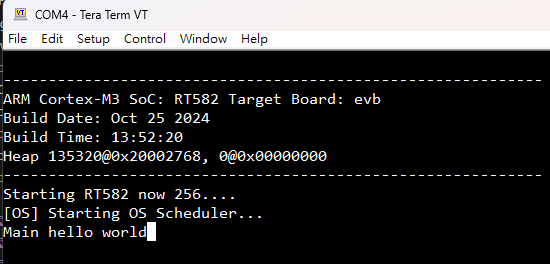

# Environment Setup

## Setup Building tool and toolchain

- Clone Project
    Using website or git command Download Rafael SDK
  - Download source code from [**Source URL**](https://github.com/RafaelMicro/Rafael-IoT-SDK)
  - Using git command clone

    ``` bash
    git clone https://github.com/RafaelMicro/Rafael-IoT-SDK
    ```

### Windows

- Install tools
    1. VScode : [**VSCodeUserSetup-x64-1.93.1.exe**](https://support.rafaelmicro.com:8088/attachments/9248/VSCodeUserSetup-x64-1.93.1.exe)
    2. GCC: [**arm-gnu-toolchain-13.3.rel1-mingw-w64-i686-arm-none-eabi.exe**](https://support.rafaelmicro.com:8088/attachments/9249/arm-gnu-toolchain-13.3.rel1-mingw-w64-i686-arm-none-eabi.exe)
    </br>**Please check "Add path to environment variable" in the last window when installing GCC.**
- Install VSCode's extensions
    1. [**C/C++, id: ms-vscode.cpptools**](https://marketplace.visualstudio.com/items?itemName=ms-vscode.cpptools)
    2. [**C/C++ Extension Pack, id: ms-vscode.cpptools-extension-pack**](https://marketplace.visualstudio.com/items?itemName=ms-vscode.cpptools-extension-pack)
    3. [**C/C++ Themes, id: ms-vscode.cpptools-themes**](https://marketplace.visualstudio.com/items?itemName=ms-vscode.cpptools-themes)
    4. [**CMake, id: twxs.cmake**](https://marketplace.visualstudio.com/items?itemName=twxs.cmake)
    5. [**CMake Tools, id: ms-vscode.cmake-tools**](https://marketplace.visualstudio.com/items?itemName=ms-vscode.cmake-tools)
    

---

## Build Project

1. Open VSCode (select File -> Open Folder...)
2. Copy Project config File from project Folder to top level, and change file name ".config"
3. Click CMake icon on left bar

4. On [No Kit Selected] click pencil icon (please select "GCC 13.3.1 arm-none-eabi")


5. Build Project


6. Compile completed

7. Firmware directory


---

## Flash Application

In System Program (ISP) tool, which packaged in Rafael IoT Evaluation Tool, please download from the [Rafael Customer Support Portal](https://support.rafaelmicro.com:8088/).


Flash code step:

1. Setup COM port:

2. Connect device:

3. Select bootloader and DUT bin file

4. Setup EVK to ISP mode (clicked reser buttom)

5. Erase and download image


---

## UART debug

This example use "Tera Term" for UART debug terminial

1. Connect device:

2. Change setting:


3. Check log


---

## JLink Debug

1. Setup Debug Tool

2. Start Debug

3. Work with Debug

