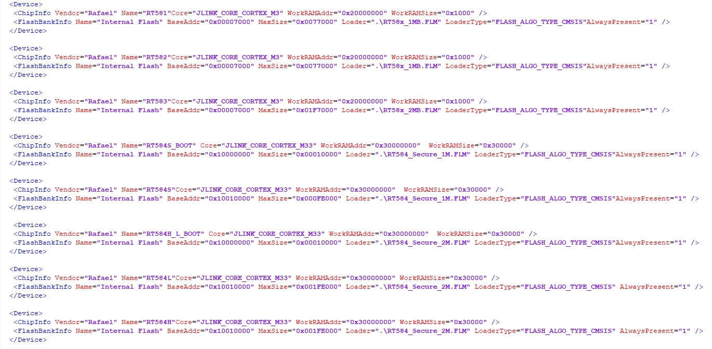

# J-Link Setup Guide

## Recommended Versions
| Tool   | Version | Notes                                 |
| ------ | ------- | ------------------------------------- |
| J-Link | v6.88a  | Recommended for flashing MCU firmware |


## 4. Download & Install J-Link V6.88a
- J-Link Website: : https://www.segger.com/downloads/jlink 
    

### J-Link Installation Instructions

1. Run the installer. You can keep the default options. Recommended settings:
   - **Install J-Link Software and Documentation**: Checked
   - **Adjusting your PATH environment**: Choose **Add J-Link to PATH**  
   - Keep other options as default

2. Click **Install** to start the installation.

### Verify Installed Version (Windows / Linux)
1. Open the command tool:
    - **Windows** → Command Prompt
    - **Linux** → Terminal
2. Type the command:
    ```bash
    JLinkExe
    ```
   Expected output:
    ```
    SEGGER J-Link Commander V6.xx (Compiled Sep xx xx:xx:xx)
    ```  
3. Update JLinkDevices.xml

    - **Option A: Overwrite the File**  
        Copy the `JLinkDevices.xml` provided by the Rafael SDK into the J-Link installation directory, replacing the existing file:

        ```bat
        copy "<SDK_PATH>\tools\JLink\JLinkDevices.xml" "C:\Program Files (x86)\SEGGER\JLink\JLinkDevices.xml"

        ⚠️ Caution: Make sure the Rafael-provided file already includes all other MCU definitions.
        Otherwise, overwriting the file may cause J-Link to lose support for other devices.

    - **Option B: Merge Manually (Recommended)**   
        If you want to preserve support for all other MCUs, manually merge only the <Device> entries for RT58x into the existing JLinkDevices.xml.

        Steps:

        Open the original JLinkDevices.xml in a text editor.

        Open the JLinkDevices.xml from <SDK_PATH>\tools\JLink\JLinkDevices.xml.

        Copy the <Device> entries related to RT58x from the SDK file and paste them inside the <Database> section of the original file.

        Save the file.

        ✅ This approach keeps support for all other devices while adding RT58x definitions.


 ### Reference the picture below:                
    
   
---
# Configure J-Link Path in VS Code
 
 Modify .vscode/settings.json for configure J-Link Path in VS Code

Open your SDK folder, locate `.vscode/settings.json`, and add the following settings.

```bash
{
    "cortex-debug.JLinkGDBServerPath": "C:/Program Files/SEGGER/JLink/JLinkGDBServerCL.exe"
}
```


