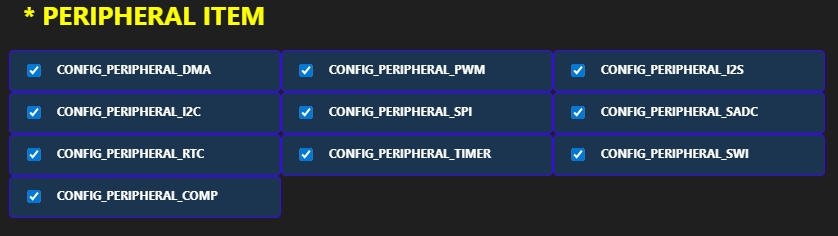
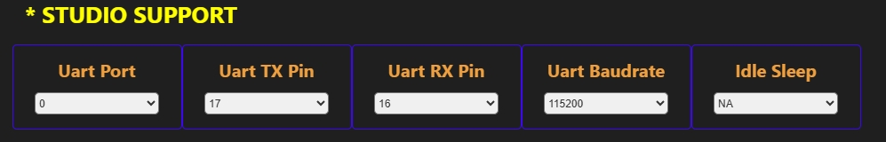
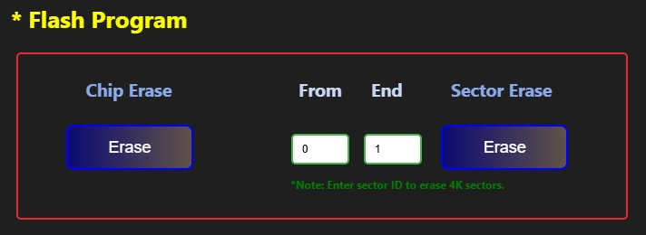

# Build Hellow Project Examples

## Usage Example

The following example demonstrates how to configure the User Space panel:

### Rafael Extension : User Space

- **Example** – Select the Hello World example project.  
- **Project Type** – Choose the Hello World project type.  
- **Chip Type** – Select rt582.  
- **Board Type** – Choose evk.  

### Rafael Extension: Peripheral Item

The Peripheral panel allows you to configure MCU peripherals for your project.  
In this example, all peripherals for the Hello World project are selected.

### Rafael Extension: Stdio Support

The Stdio Support panel allows you to configure the MCU's standard I/O UART for your project. The following settings are kept at their default values:

- **UART Port** – Configure the UART instance to use (default setting).  
- **UART TX** – Configure the UART TX pin to 17 (default setting).  
- **UART RX** – Configure the UART RX pin to 16 (default setting).  
- **UART Baud Rate** – Set the baud rate to 115200 (default setting).  
- **Idle Sleep** – Configure the Hello World project to not enter sleep mode (N/A mode).

### Rafael Extension: User Build Image

The User Build Image panel allows you to configure and build your project using CMake. You can set the following option:

- **Build Process** – For the first build, use the **Rebuild** button. After that, if you only modify some files, you can use the **Build** button to compile the changes.  
  Once the build is successful, the binary file name will appear in the Download Image panel.
   
   

- **Select Button** – Choose the path to the CMake executable. Make sure to select the correct path according to your CMake installation, otherwise the build will fail.  

  #### Reference the picture below:
  

- **Build Button** – Execute the CMake build process and build modified files. 
  #### Reference the picture below: 
     
- **Rebuild Button** – Execute the CMake build process with a clean build of all files.  
  ####  Reference the picture below: 
     

### Rafael Extension: Flash Programe

The Flash Program panel allows you to erase and program the MCU flash. You can use the following options:

> **Note:**
> - By default, there is no need to use the Chip Erase or Sector Erase buttons. You can adjust them according to your development needs. The Download button in the Download Image panel will automatically calculate the binary size and perform the necessary erase and write operations.  
>   

- **Chip Erase Button** – Erase the entire chip. This will erase both the bootloader and application, but the MP sector flash address will be retained.  

- **Sector Erase Button** – Erase user-specified sectors (4K each). You need to calculate the sector numbers according to the flash size to determine the erase range. Be careful, as sector erase can also erase MP sector data.

### Rafael Extension: User Download Image

The User Download Image panel allows you to program the MCU flash with a binary file. You can use the following options:

After a successful build, the file will be displayed in the text field below.  

> **Note:**
> - Bootloader start addresses:  
>   - RT581 / RT582 / RT583: <code>0x00000000</code>
>   - RT584: <code>0x10000000</code>
> 
> - Application start addresses:  
>   - RT581 / RT582 / RT583: <code>0x00008000</code>
>   - RT584: <code>0x10010000</code>

- **Address** – Set the flash programming start address. The extension will automatically set the default address according to the selected configuration type.
  
- **Select Button** – Select another binary file to download. The selected file will be displayed in the text field below.  
    #### Reference the picture below:
  

- **Download Button** – Start programming the selected file. Once the download is complete, the message will appear in the terminal.
  #### Reference the picture below:
  

