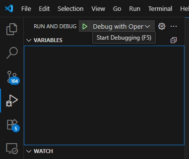

# Debug
### 

## 1. VS Code Debug Mode
- Choose the VS Code Debug Icon  
    
- Enter Debug Mode Succes  
  
  
## 2. VS Code Debug Tool Bar

- 
        
  **Reset Device**    : 	Reset program execution
    
     **Continue**        :	Continue program execution  
     - Shortcuts : F5  
  
    **Step Over**       : Skip the current function and move to the next line  
     - Shortcuts : F10 

    **Step Into**       : 	Step into the function for line-by-line execution  
     - Shortcuts : F11 

    **Step Out**        : Step out of the current function   
     - Shortcuts : Shift+F11

    **Restart**         : Restart the debugging session   
     - Shortcuts : Ctrl+Shift+F5

    **Stop**            : Sotp Debug  
     - Shortcuts : Shift+F5

## 3. VS Code Debug Panels

    

- **Variables Panel**  
  Shows current variable values in scope. Inspect or modify them during runtime.  
      -   

- **Watch Panel**  
  Track specific variables or expressions continuously.  
      -  

- **Call Stack Panel**  
  Displays the sequence of active function calls.  
      -    

- **Breakpoints Panel**  
  Lists and manages all active breakpoints.
      -    
  
- **XPeripherals Panel**  
  Lists and manages all active breakpoints.  
      -    

- **Debug Console**  
  Interactive console for commands and program output.  
      -  
  
- **Memory View**  
Displays memory contents at selected addresses. Requires **Memory View** extension: `mcu-debug.memory-view`.  
      -  
  
- **Serial Monitor**  
  View and send data through serial ports. Requires **Serial Monitor** extension: `ms-vscode.vscode-serial-monitor`.
      -  
  
