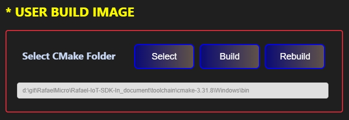

# Rafael Extension 

  

    
<strong>Choose the Rafael Extension Icon</strong>

    
  

  

    
<strong>Open Rafael Extension</strong>

     
  

## Rafael Extension: Left-Hand Panel Overview

The left-hand panel of the Rafael Extension provides four main functions:

- **Install Package** – Install required SDK packages or dependencies.
- **Build Project Image** – Compile and build the selected example or project image.
- **Create User Project** – Generate a new user project based on the selected example and configuration.
- **Build User Project** – Build the user project after configuration and editing.

## Install Package

### Rafael Extension: Install Package

The Install Package panel allows you to install the required software packages for the SDK. SDK development requires the VS Code Extension package. You can use the following options:

- **Install Python Package Button** – Install the required Python packages.
- **Install Extension Package Button** – Install the VS Code extension package required for SDK development.

-  Using Rafael Extension in VS Code:
   - Install Python and VS Code extensions Finish
      
      

## Build Project Image

### Rafael Extension : User Space

The User Space panel allows you to configure the following options:

- **Example** – Select an example project.
- **Project Type** – Choose the type of project.
- **Chip Type** – Select the target chip.
- **Board Type** – Choose the target board.

### Rafael Extension: Peripheral Item

The Peripheral panel allows you to configure MCU peripherals for your project.

### Rafael Extension: Stdio Support

The Stdio Support panel allows you to configure the MCU's standard I/O UART for your project. You can set the following options:

- **UART Port** – Select the UART instance to use.
- **UART TX** – Select the UART TX pin number.
- **UART RX** – Select the UART RX pin number.
- **UART Baud Rate** – Set the communication speed.
- **Idle Sleep** – Configure the project to not enter sleep mode (N/A for this project).

### Rafael Extension: User Build Image

The User Build Image panel allows you to configure and build your project using CMake. You can set the following options:

- **Select Button** – Select the CMake executable path.  
- **Build Button** – Execute the CMake build process and build modified files.  
- **Rebuild Button** – Execute the CMake build process with a clean build of all files.  
  

### Rafael Extension: Flash Programe

The Flash Program panel allows you to erase and program the MCU flash. You can use the following options:

- **Chip Erase Button** – Erase the entire chip.
- **Sector Erase Button** – Erase user-specified sectors (4K)

### Rafael Extension: User Download Image

The User Download Image panel allows you to program the MCU flash with a binary file. You can use the following options:

- **Address** – Set the flash programming start address.
- **Select Button** – Select the binary file to program.
- **Download Button** – Start programming the selected file.
  

> **Note:**  
> - Bootloader start addresses:  
>   - RT581 / RT582 / RT583: `0x00000000`  
>   - RT584: `0x10000000`
> 
> - Application start addresses:  
>   - RT581 / RT582 / RT583: `0x00008000`  
>   - RT584: `0x10010000`  

## Create User Project

### Rafael Extension: Create Project

The Create Project panel allows you to create a new SDK project. You can use the following options:

- **Create Project Select** – Choose how to create the project:
  - Create a new template project
  - Create a project from an existing project
- **Project Name** – Set the name of the project.
- **Select** – Select the project template.
- **Create** – Generate the project in the user folder.
-   

> **Note:**  
> - When creating a project from an existing project, you need to select a default config file:  
>   - `default-rt581-evb.config`  
>   - `default-rt582-evb.config`  
>   - `default-rt583-evb.config`  
>   - `default-rt584s-evb.config`  
>   - `default-rt584h-evb.config`  
>   - `default-rt584l-evb.config`  

### Rafael Extension: User Build Image

The User Build Image panel allows you to configure and build your project using CMake. You can use the following options:

- **Config** – Select the chip configuration for the project.
- **Select Button** – Select the path to the CMake executable.
- **Build Button** – Run the CMake build process.

### Rafael Extension: Menu Config

The Menu Config panel allows you to modify the project configuration. You can use the following option:

- **Config Button** – Open the menu to modify the project configuration.

### Rafael Extension: ISP Tool (Windows Only)

The ISP Tool panel allows you to launch the ISP utility for programming. You can use the following option:

- **Execute Button** – Open the ISP tool.

## Build User Project

> **Note:**  
>    Build User Project is mainly used for building projects created by the user.  
    The build process is the same as Build Project Images.  
    This allows you to compile and generate binaries for your own projects just like building example project images. 

### Rafael Extension : User Space
The User Space panel allows you to configure the following options:

- **Example** – Select an example project.
- **Project Type** – Choose the type of project.
- **Chip Type** – Select the target chip.
- **Board Type** – Choose the target board.

### Rafael Extension: Peripheral Item

The Peripheral panel allows you to configure MCU peripherals for your project.

### Rafael Extension: Stdio Support

The Stdio Support panel allows you to configure the MCU's standard I/O UART for your project. You can set the following options:

- **UART Port** – Select the UART instance to use.
- **UART TX** – Select the UART TX pin number.
- **UART RX** – Select the UART RX pin number.
- **UART Baud Rate** – Set the communication speed.
- **Idle Sleep** – Configure the project to not enter sleep mode (N/A for this project).

### Rafael Extension: User Build Image

The User Build Image panel allows you to configure and build your project using CMake. You can set the following options:

- **Select Button** – Select the CMake executable path.  
- **Build Button** – Execute the CMake build process and build modified files.  
- **Rebuild Button** – Execute the CMake build process with a clean build of all files.  

### Rafael Extension: Flash Programe

The Flash Program panel allows you to erase and program the MCU flash. You can use the following options:

- **Chip Erase Button** – Erase the entire chip.
- **Sector Erase Button** – Erase user-specified sectors (4K)

### Rafael Extension: User Download Image

The User Download Image panel allows you to program the MCU flash with a binary file. You can use the following options:

- **Address** – Set the flash programming start address.
- **Select Button** – Select the binary file to program.
- **Download Button** – Start programming the selected file.
  

> **Note:**  
> - Bootloader start addresses:  
>   - RT581 / RT582 / RT583: `0x00000000`  
>   - RT584: `0x10000000`
> 
> - Application start addresses:  
>   - RT581 / RT582 / RT583: `0x00008000`  
>   - RT584: `0x10010000`  
