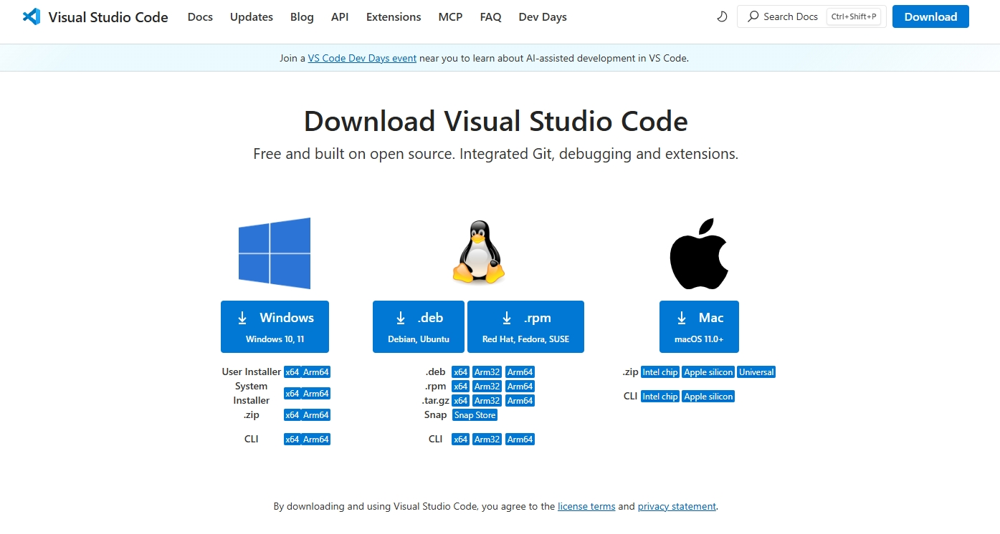
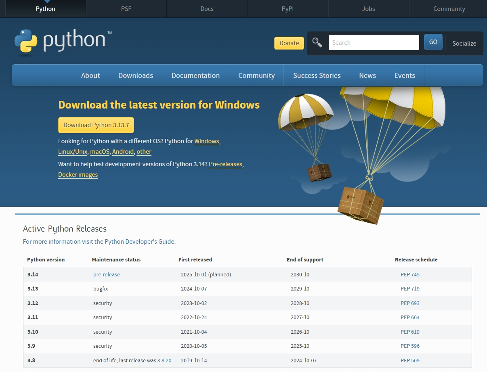
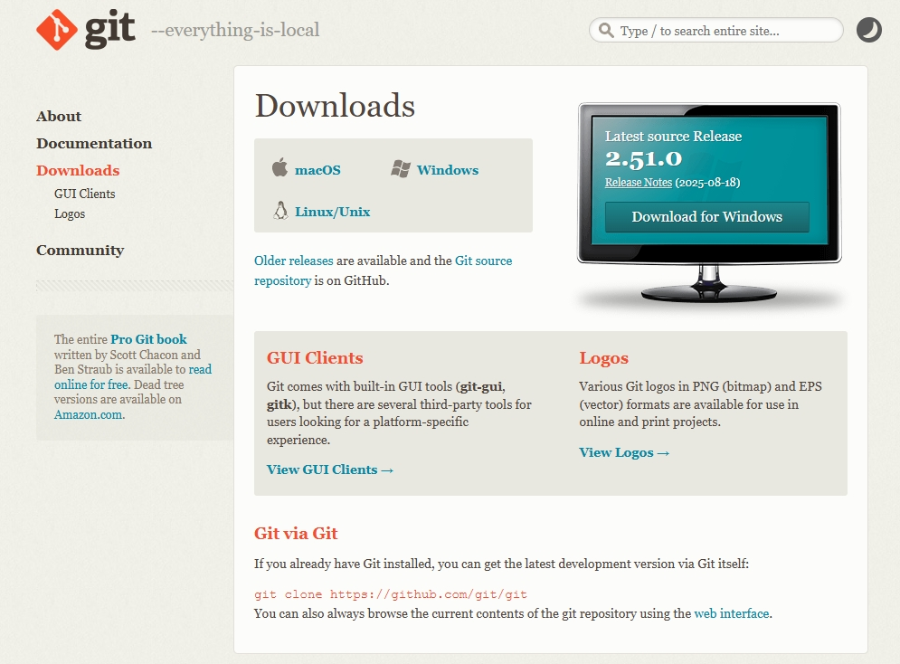
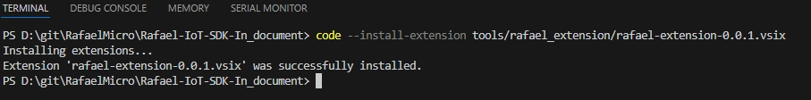
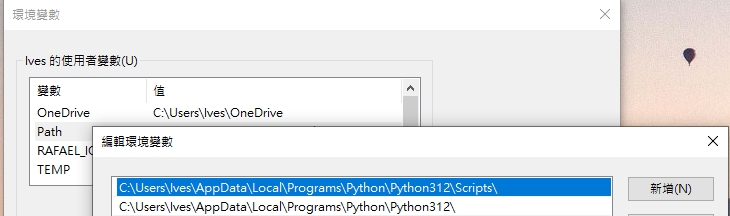

# Rafael IoT SDK2.0 
### Development Environment Setup Guide

## Recommended Versions
| Tool              | Version       | Notes                                           |
| ----------------- | ------------- | ----------------------------------------------- |
| ARM GNU Toolchain | 14.2 or later | Official precompiled binaries                   |
| CMake             | 3.24 or later | Requires support for `Presets` and Ninja        |
| Ninja             | 1.11 or later | Typically used with CMake                       |
| Git               | 2.39 or later | Git LFS recommended                             |
| Python            | 3.10 or later | Used for CMake scripts and toolchain management |
| VS Code           | 1.80 or later | Recommended with CMake Tools / Cortex-Debug     |
| J-Link            | v6.88a        | Recommended for flashing MCU firmware           |

## 1. Install VS Code
  **VS Code Website:** https://code.visualstudio.com/  
  Choose the appropriate version (Windows/Mac/Linux)
  
  
# Install Visual Studio Code (Default Settings)

1. Download the **Windows Installer** (User Installer recommended).  
2. Run the installer. During installation, you can safely leave all default options checked, including:  
   - Add **"Open with Code"** action to context menu  
   - Add to **PATH**  
   - Register as the default editor for supported file types  
3. Click **Install** to start the installation.  
4. Once installed, you can launch VS Code from the **Start menu**.  

> Default settings are sufficient. You can customize later via **File > Preferences > Settings**.


  Verify Installed Version (Windows / Linux)

  1. Open the command tool:
      - **Windows** → Command Prompt
      - **Linux** → Terminal
  2. Type the command:
      ```bash
      code -v
      ```

## 2. Install Python
- Python Website: https://www.python.org/downloads/
    

### Install Python (Default Settings)

  1. Run the installer. During installation, it is recommended to select:  
     - **Add Python to PATH**  
     - Keep the default installation directory  
  2. Click **Install Now** to start the installation.  

- Verify Installed Version (Windows / Linux)

  1. Open the command tool:
      - **Windows** → Command Prompt
      - **Linux** → Terminal
  2. Type the command:
      ```bash
      python --version
      ```

## 3. Install Git
- Git Website: : https://git-scm.com/downloads
    

### Git Installation Instructions

Run the installer. You can keep the default options. Recommended settings:

- **Adjusting your PATH environment**: Choose **Git from the command line and also from 3rd-party software**  
- **Choosing HTTPS transport backend**: Choose **Use the OpenSSL library**  
- Keep other options as default

Click **Install** to start the installation.

- Verify Installed Version (Windows / Linux)

  1. Open the command tool:
      - **Windows** → Command Prompt
      - **Linux** → Terminal
  2. Type the command:
      ```bash
      git --version
      ```
- Clone Rafael-Iot-SDK repository:
  ```sh
  git clone https://github.com/RafaelMicro/Rafael-IoT-SDK.git
  ```
---
## 4. J-Link Setup Reference Documents
- [J-Link Setup](../SDK_Setup/sdk-setup-jlink.md) 
---

---
## 5. Toolchain Install Reference Documents  
- [Toolcahin Setup](../../toolchain/README.md) 
---

---

## 6. Install Rafael Extension Reference Documents  
- [Rafael Extension](../../docs/sdk_extension.md) 
-  Open SDK folder using VS Code
  1. Open the command tool:
      - **Windows** → Command Prompt
      - **Linux** → Terminal
  2. Install Rafael VS Code extension:
      ```sh
      code --install-extension tools/rafael_extension/rafael-extension-0.0.1.vsix
      ```
         
---

---
## 6. Check Toolchain, CMake, and Python Environment Variables
- Ensure `PATH` variable includes the Toolchain `bin\`directory
- Add `TOOLCHAIN_PATH` environment variable pointing to the GCC Toolchain directory
- Check Python paths:
     - C:\Users\user\AppData\Local\Programs\Python\Python312\Scripts\
     - C:\Users\user\AppData\Local\Programs\Python\Python312\
         


### Other

####  Manual Install Requriemtn Tool (extensions.txt/requirements.txt)
- File path: `SDK\tools\requirements.txt`
- Open terminal and navigate:
  cd SDK\tools\requriement
- Install using pip:
  ```sh
  pip install -r requirements.txt
  ```
- Install rafael extension:
  ```sh
  code --install-extension rafael-extension-0.0.1.vsix
  ```
- Install using Python script:
  ```sh
  Python extensions.py
  ```
