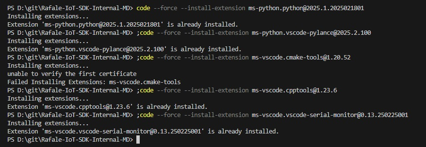
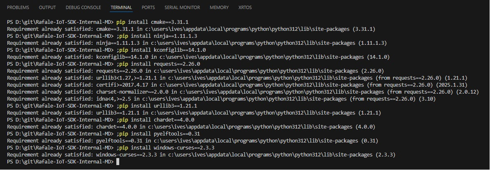

# Rafael IoT SDK2.0 
### Development Environment Setup Guide

## Recommended Versions
| Tool              | Version       | Notes                                           |
| ----------------- | ------------- | ----------------------------------------------- |
| ARM GNU Toolchain | 14.2 or later | Official precompiled binaries                   |
| CMake             | 3.24 or later | Requires support for `Presets` and Ninja        |
| Ninja             | 1.11 or later | Typically used with CMake                       |
| Git               | 2.39 or later | Git LFS recommended                             |
| Python            | 3.10 or later | Used for CMake scripts and toolchain management |
| VS Code           | 1.80 or later | Recommended with CMake Tools / Cortex-Debug     |
| J-Link            | v6.88a        | Recommended for flashing MCU firmware           |

## 1. Install VS Code
  **VS Code Website:** https://code.visualstudio.com/  
  Choose the appropriate version (Windows/Mac/Linux)
  
  
# Install Visual Studio Code (Default Settings)

1. Download the **Windows Installer** (User Installer recommended).  
2. Run the installer. During installation, you can safely leave all default options checked, including:  
   - Add **"Open with Code"** action to context menu  
   - Add to **PATH**  
   - Register as the default editor for supported file types  
3. Click **Install** to start the installation.  
4. Once installed, you can launch VS Code from the **Start menu**.  

> Default settings are sufficient. You can customize later via **File > Preferences > Settings**.


  Verify Installed Version (Windows / Linux)

  1. Open the command tool:
      - **Windows** → Command Prompt
      - **Linux** → Terminal
  2. Type the command:
      ```bash
      code -v
      ```

## 2. Install Python
- Python Website: https://www.python.org/downloads/
    

### Install Python (Default Settings)

  1. Run the installer. During installation, it is recommended to select:  
     - **Add Python to PATH**  
     - Keep the default installation directory  
  2. Click **Install Now** to start the installation.  

- Verify Installed Version (Windows / Linux)

  1. Open the command tool:
      - **Windows** → Command Prompt
      - **Linux** → Terminal
  2. Type the command:
      ```bash
      python --version
      ```

## 3. Install Git
- Git Website: : https://git-scm.com/downloads
    

### Git Installation Instructions

Run the installer. You can keep the default options. Recommended settings:

- **Adjusting your PATH environment**: Choose **Git from the command line and also from 3rd-party software**  
- **Choosing HTTPS transport backend**: Choose **Use the OpenSSL library**  
- Keep other options as default

Click **Install** to start the installation.

- Verify Installed Version (Windows / Linux)

  1. Open the command tool:
      - **Windows** → Command Prompt
      - **Linux** → Terminal
  2. Type the command:
      ```bash
      git --version
      ```
- Clone Rafael-Iot-SDK repository:
  ```sh
  git clone https://github.com/RafaelMicro/Rafael-IoT-SDK.git
  ```

## 4. Download & Install J-Link V6.88a
- J-Link Website: : https://www.segger.com/downloads/jlink 
    

### J-Link Installation Instructions

1. Run the installer. You can keep the default options. Recommended settings:
   - **Install J-Link Software and Documentation**: Checked
   - **Adjusting your PATH environment**: Choose **Add J-Link to PATH**  
   - Keep other options as default

2. Click **Install** to start the installation.

### Verify Installed Version (Windows / Linux)
1. Open the command tool:
    - **Windows** → Command Prompt
    - **Linux** → Terminal
2. Type the command:
    ```bash
    JLinkExe
    ```
   Expected output:
    ```
    SEGGER J-Link Commander V6.xx (Compiled Sep xx xx:xx:xx)
    ```  

 ### Adding Rafael RT58x MCU Support in JLinkDevices.xml
  JLinkDevices.xml Default Path : 

  ```bash
    Windows (64-bit)  - C:\Program Files\SEGGER\JLink\JLinkDevices.xml
    Windows (32-bit)  - C:\Program Files (x86)\SEGGER\JLink\JLinkDevices.xml
  ```

> **Note**
>
> ```xml
> <Device>
>     <ChipInfo Vendor="Rafael" Name="RT581"  
>               Core="JLINK_CORE_CORTEX_M3"   
>               WorkRAMAddr="0x20000000"   
>               WorkRAMSize="0x1000" />  
>     <FlashBankInfo Name="Internal Flash"  
>                    BaseAddr="0x00007000"
>                    MaxSize="0x00F7000"  
>                    Loader=".\RT58x_1MB.FLM"  
>                    LoaderType="FLASH_ALGO_TYPE_CMSIS"  
>                    AlwaysPresent="1" />  
> </Device>
>
> <Device>
>     <ChipInfo Vendor="Rafael" Name="RT582"  
>               Core="JLINK_CORE_CORTEX_M3"   
>               WorkRAMAddr="0x20000000"   
>               WorkRAMSize="0x1000" />  
>     <FlashBankInfo Name="Internal Flash"  
>                    BaseAddr="0x00007000"
>                    MaxSize="0x00F7000"  
>                    Loader=".\RT58x_1MB.FLM"  
>                    LoaderType="FLASH_ALGO_TYPE_CMSIS"  
>                    AlwaysPresent="1" />  
> </Device>
> <Device>
>     <ChipInfo Vendor="Rafael" Name="RT583"  
>               Core="JLINK_CORE_CORTEX_M3"   
>               WorkRAMAddr="0x20000000"   
>               WorkRAMSize="0x1000" />  
>     <FlashBankInfo Name="Internal Flash"  
>                    BaseAddr="0x00007000"
>                    MaxSize="0x01F7000"  
>                    Loader=".\RT58x_2MB.FLM"  
>                    LoaderType="FLASH_ALGO_TYPE_CMSIS"  
>                    AlwaysPresent="1" />  
> </Device>
> <Device>
>     <ChipInfo Vendor="Rafael" Name="RT584S_BOOT"  
>               Core="JLINK_CORE_CORTEX_M3"   
>               WorkRAMAddr="0x30000000"   
>               WorkRAMSize="0x30000" />  
>     <FlashBankInfo Name="Internal Flash"  
>                    BaseAddr="0x10000000"
>                    MaxSize="0x00010000"
>                    Loader=".\RT584S_Secure_1M.FLM"  
>                    LoaderType="FLASH_ALGO_TYPE_CMSIS"  
>                    AlwaysPresent="1" />  
> </Device>
> <Device>
>     <ChipInfo Vendor="Rafael" Name="RT584S"  
>               Core="JLINK_CORE_CORTEX_M3"   
>               WorkRAMAddr="0x30000000"   
>               WorkRAMSize="0x30000" />  
>     <FlashBankInfo Name="Internal Flash"  
>                    BaseAddr="0x10010000"
>                    MaxSize="0x000FE000"
>                    Loader=".\RT584S_Secure_1M.FLM"  
>                    LoaderType="FLASH_ALGO_TYPE_CMSIS"  
>                    AlwaysPresent="1" />  
> </Device>
> <Device>
>     <ChipInfo Vendor="Rafael" Name="RT584H_L_BOOT"  
>               Core="JLINK_CORE_CORTEX_M3"   
>               WorkRAMAddr="0x30000000"   
>               WorkRAMSize="0x30000" />  
>     <FlashBankInfo Name="Internal Flash"  
>                    BaseAddr="0x10000000"
>                    MaxSize="0x00010000"
>                    Loader=".\RT584_Secure_2M.FLM"  
>                    LoaderType="FLASH_ALGO_TYPE_CMSIS"  
>                    AlwaysPresent="1" />  
> </Device>
> <Device>
>     <ChipInfo Vendor="Rafael" Name="RT584H"  
>               Core="JLINK_CORE_CORTEX_M3"   
>               WorkRAMAddr="0x30000000"   
>               WorkRAMSize="0x30000" />  
>     <FlashBankInfo Name="Internal Flash"  
>                    BaseAddr="0x10010000"
>                    MaxSize="0x001FE000"
>                    Loader=".\RT584_Secure_2M.FLM"  
>                    LoaderType="FLASH_ALGO_TYPE_CMSIS"  
>                    AlwaysPresent="1" />  
> </Device>
> <Device>
>     <ChipInfo Vendor="Rafael" Name="RT584L"  
>               Core="JLINK_CORE_CORTEX_M3"   
>               WorkRAMAddr="0x30000000"   
>               WorkRAMSize="0x30000" />  
>     <FlashBankInfo Name="Internal Flash"  
>                    BaseAddr="0x10010000"
>                    MaxSize="0x001FE000"
>                    Loader=".\RT584_Secure_2M.FLM"  
>                    LoaderType="FLASH_ALGO_TYPE_CMSIS"  
>                    AlwaysPresent="1" />  
> </Device>
> ```

 ### Reference the picture below:                
    
   
---
# Configure J-Link Path in VS Code
 ## Modify .vscode/settings.json for configure J-Link Path in VS Code

Open your SDK folder, locate `.vscode/settings.json`, and add the following settings.

Please modify the paths according to your actual J-Link installation directory.

```bash
  Windows (64-bit)  - C:\Program Files\SEGGER\JLink\
  Windows (32-bit)  - C:\Program Files (x86)\SEGGER\JLink\
  


{
    "cortex-debug.JLinkPath": "C:/Program Files/SEGGER/JLink/JLink.exe",
    "cortex-debug.JLinkGDBServerPath": "C:/Program Files/SEGGER/JLink/JLinkGDBServerCL.exe"
}
```

---

## 4. Install Rafael Extension
-  Open SDK folder using VS Code
  1. Open the command tool:
      - **Windows** → Command Prompt
      - **Linux** → Terminal
  2. Install Rafael VS Code extension:
      ```sh
      code --install-extension tools/rafael_extension/rafael-extension-0.0.1.vsix
      ```
         
-  Using Rafael Extension in VS Code:
   - Press Install Python and VS Code extensions button
      
   - Install Python and VS Code extensions Finish
      
      
## 5. Check Toolchain, CMake, and Python Environment Variables
- Ensure `PATH` variable includes the Toolchain `bin\`directory
- Add `TOOLCHAIN_PATH` environment variable pointing to the GCC Toolchain directory
- Check Python paths:
     - C:\Users\user\AppData\Local\Programs\Python\Python312\Scripts\
     - C:\Users\user\AppData\Local\Programs\Python\Python312\
         


### Other

####  Manual Install Requriemtn Tool (extensions.txt/requirements.txt)
- File path: `SDK\tools\requirements.txt`
- Open terminal and navigate:
  cd SDK\tools\requriement
- Install using pip:
  ```sh
  pip install -r requirements.txt
  ```
- Install rafael extension:
  ```sh
  code --install-extension rafael-extension-0.0.1.vsix
  ```
- Install using Python script:
  ```sh
  Python extensions.py
  ```
