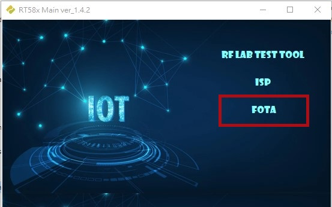
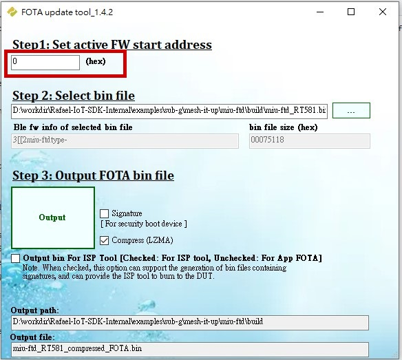
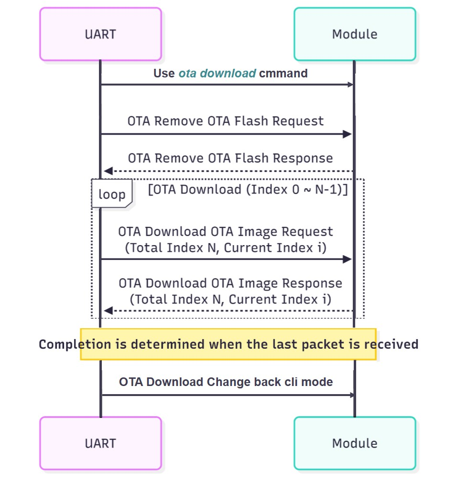
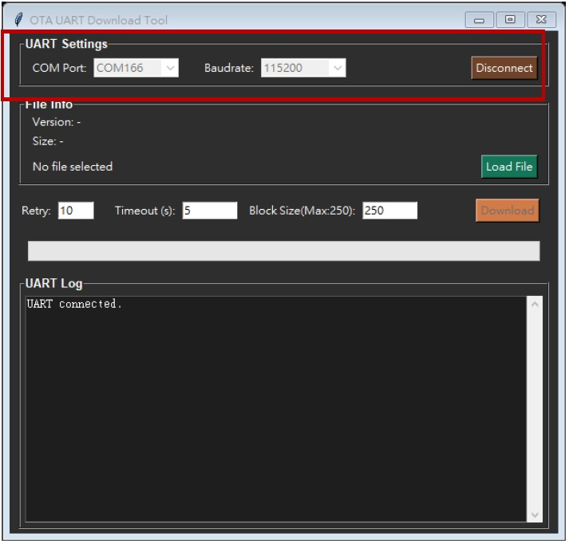
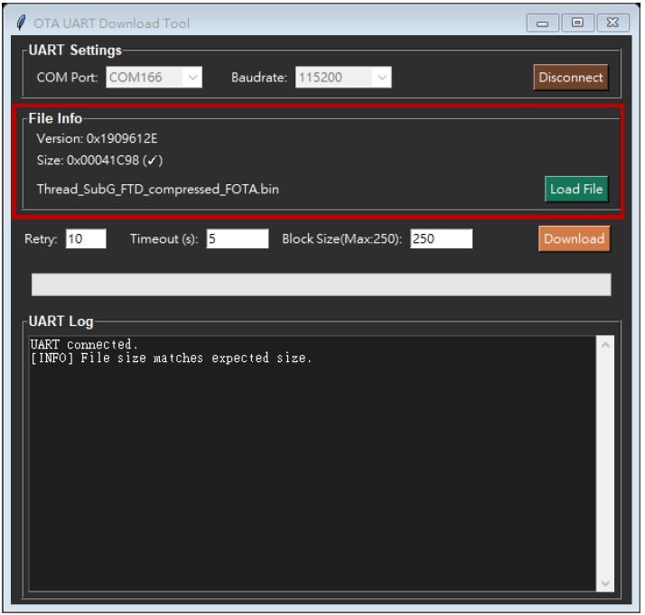

# ota-guide.md

## Thread Over-The-Air (OTA) Update Guide

This document outlines the process, tool usage, and underlying software components for performing a Firmware Over-The-Air (FOTA) update on Rafael Microelectronics (MIU) Thread devices.

---

## 1. Thread OTA Update Process Flow

The OTA Update process involves four main steps:

1.  **Compress BIN:** Use the **IoT\_EVALUATION\_TOOL** to compress the new binary file and generate the necessary FOTA header.
2.  **Transmit BIN:** Use the dedicated **OTA Download Tool** to transmit the updated binary file via **UART1** to the target RT58x device.
3.  **Send OTA CLI Command:** Once the download is complete, send a specific OTA CLI command (or use the tool's interface) to trigger the update process.
4.  **Reboot & Load:** The RT58x device automatically reboots and initiates the bootloader sequence to load the new firmware from the OTA flash partition.

---

## 2. Firmware Over-The-Air (FOTA) Preparation

### 2.1 Generating Compressed BIN using IoT\_EVALUATION\_TOOL

The firmware image must be compressed and formatted using the evaluation tool before transmission.

1.  Open the `IoT_EVALUATION_TOOL` and select the **"FOTA"** update option.
### Figure 1: IoT_EVALUATION_TOOL
  <p align="center">
    
  </p>
3.  Set the **"active FW start address"** to `0` (hex).
4.  Select the new binary file in **"Step 2: Select bin file"**.
5.  In **"Step 3: Output FOTA bin file"**, ensure the **"Compress (LZMA)"** option is checked.
6.  Click the **"Output"** button to generate the compressed BIN file (e.g., `compressed_FOTA.bin`).

### Figure 2: FOTA update tool
  <p align="center">
    
  </p>
  
### 2.2 Compressed BIN Header Structure (0x20 Bytes)

The compressed binary image includes a mandatory 32-byte (0x20) header at the beginning for metadata, which is critical for the bootloader.

| Field | Size (Byte) | Description |
| :--- | :--- | :--- |
| **Version** | 4 | Firmware version (little-endian, hexadecimal format). |
| **Type** | 12 | Firmware type string (e.g., `"threadftdbin"`). |
| **Checksum** | 4 | CRC value of the entire compressed BIN file (excluding the header itself). |
| **Start** | 4 | Firmware start address (usually `0x00000000`). |
| **End** | 4 | Firmware end address. The total BIN size is calculated from this field. |
| **Reserved** | 4 | Reserved field. |

---

## 3. OTA Command Structure (UART/Protocol)

The OTA Download command uses a specific little-endian format for raw data communication over UART.

| Field | Size (Byte) | Description |
| :--- | :--- | :--- |
| **Header** | 4 | Fixed OTA Header: `FFFCFCFF`. |
| **Length** | 1 | Payload length (excluding Header, Length, and Checksum). |
| **Command Id** | 4 | Identifies the command type. |
| **Address** | 2 | Source identifier (typically `0000` when from UART). |
| **Address mode** | 1 | Reserved, fixed `00`. |
| **Parameter** | N | Command-specific data payload (e.g., image chunk). |
| **Checksum** | 1 | Checksum is calculated as the bitwise NOT (`~`) of the sum of all bytes from Length field up to, but excluding, the Checksum field. |

### 3.1 Key OTA Commands and Sequence

The download tool and device communicate using specific Command IDs:

| Command Name | Command Id | Purpose |
| :--- | :--- | :--- |
| **Remove OTA Flash Request** | `000000F0` | Requests the device to erase the OTA flash partition before download. |
| **OTA Download Response** | `008000F0` | Device response indicating the status of the flash erase operation. |
| **Download OTA Image Request** | `010000F0` | Used repeatedly to send image chunks during the file transfer process. |
| **Change to CLI** | `020000F0` | Switch debug uart(uart 0) back to cli mode. |

The download sequence is: cli change to hex mode $\rightarrow$ Erase Request $\rightarrow$ Erase Response $\rightarrow$ Download Image Request (loop for all segments) $\rightarrow$ hex mode change cli mode.

### Figure 3: OTA Download Sequence
  <p align="center">
    
  </p>
  
---

## 4. Software Implementation Details

The device's OTA logic tracks progress using a state machine and uses OpenThread CoAP resources for network-based updates.

### 4.1 OTA States (`OtaStateToString`)

The device maintains the following states during the OTA process:

| State Name (Enum) | String Representation | Description |
| :--- | :--- | :--- |
| `OTA_IDLE` | "Idle" | Default state, no update currently active. |
| `OTA_DATA_SENDING` | "DataSending" | Sending multicast OTA data segments (typically the Leader role). |
| `OTA_DATA_RECEIVING` | "DataReceiving" | Receiving multicast OTA data segments (typically the End Device role). |
| `OTA_UNICAST_RECEIVING` | "UnicastReceiving" | Receiving unicast data segments (e.g., re-requesting missing parts). |
| `OTA_REQUEST_SENDING` | "RequestSending" | Sending a request for missing data segments to the Leader. |
| `OTA_DONE` | "Done" | The image download and verification are complete. |
| `OTA_REBOOT` | "Reboot" | The device is preparing to reboot to load the new image. |

### 4.2 Application CLI OTA Commands

The following commands are available via the application's Command Line Interface (CLI) for initiating, monitoring, and controlling the OTA process:

| Command | Function | Notes |
| :--- | :--- | :--- |
| `ota start <segments> <interval>` | Starts the OTA image transmission to all devices. | `<segments>` is the size of the segmented data to be transmitted. `<interval>` is the transmission interval (ms) between each packet. |
| `ota send <ipv6>` | Triggers the OTA image transmission to a specific IPv6 address. | |
| `ota stop` | Stops the current OTA image transmission. | |
| `ota self` | Triggers the OTA update process on the device itself. | Used after the image is fully downloaded. |
| `ota debug <level>` | Sets the OTA debug log level. | |
| `ota erase` | Manually erases the OTA flash partition. | |
| `ota rxmode <on/off>` | Set the sleeping mtd rx mode. | |
| `ota status <ipv6> <ftd/mtd/all> <report timeout (ms)>` | **(FTD Only)** Queries the version and RX mode status of remote devices. | |
| `ota status table <reset>` | **(FTD Only)** Queries the local table containing OTA version information. | Note: After the query is completed, please use `ota satus table reset` to free up the memory.|
| `ota execute reboot <ipv6> <time (ms)>` | Sends a CoAP command to trigger a remote device reboot and update. | All devices use ip ff03::1 |
| `ota download` | **Switches the local UART to hex receive mode** to accept raw OTA data from the external download tool. | Required before using the external OTA Download Tool. |

## 5. OTA Download Tool Operation Steps

This section details the steps for utilizing the **OTA Download Tool** to transfer the firmware image to the device via UART.

### 5.1 Connection Setup

1.  **Change to Hex mode (CLI):** On your target device's Command Line Interface (CLI), enter the command:
    ```bash
    ota download
    ```
    This switches the UART to raw hexadecimal receive mode, preparing the device for data transfer.
2.  **Open Tool:** Launch the `OTA Download Tool` application.
3.  **Select COM Port:** In the tool interface, select the correct **COM Port** connected to your Thread device (which must be a **Leader/FTD** device for initiating the transfer).
4.  **Set Baud Rate:** Ensure the **Baud Rate** is set to the correct value (typically `115200`).
5.  **Connect:** Click the **"Connect"** button to establish the serial connection.

### Figure 3: OTA Download Uart Connect
  <p align="center">
    
  </p>
  
### 5.2 Firmware File Loading and Parameter Configuration

1.  **Load File:** Click the **"Load File"** button and select the **compressed FOTA BIN file** you generated in Section 2 (e.g., `your_firmware_fota.bin`).
2.  **Set Transfer Parameters:** Configure the following parameters, which control the stability of the UART transfer:
    * **Retry:** Retry several times in total, try after each timeout.
    * **Timeout:** Sets the waiting time (in milliseconds) for an OTA Download Response.
    * **Block Size:** Set the segment size for the image transfer.
3.  **Execute Download:** Press the **Download** button and wait for the process to report success or failure.

### Figure 4: OTA Download Load File 
  <p align="center">
    
  </p>

---

## 6. OTA Remote Update Operation Steps

Remote updates use the OpenThread network to send firmware image pieces or management commands to other devices.

First, check the current OTA version information using the `ota` command:
```bash
ota
ota state : Idle
ota image version : 0x335774ac
ota image size : 0x000435c8
ota image crc : 0xdb115b6f
current bin version : 0x335b5b32
```

### 6.1 One-to-many device Update (Multicast)

These steps use the Leader device to multicast the new firmware image to all other devices.

1.  Execute the command to start the OTA image transmission:
    ```bash
    ota start 255 2000
    ```
    (This starts the Leader transmitting data with 255 segments and a 2000ms interval between transmissions.)
2.  Execute `ota debug 1` to observe the data transmission status and logs on the Leader.
3.  After the transmission shows completion on the Leader, query the status of all devices using the multicast address (`ff03::1`):
    ```bash
    ota status ff03::1 all 60000
    ```
    (This requests a status report from all devices, waiting for up to 60,000ms (1 minute) for responses.)
4.  After waiting for the report timeout (1 minute), use `ota status table` to view the statistical results of which devices received the image successfully.
5.  Once all discoveries are complete, use the following command to clear the status table to ensure memory is freed:
    ```bash
    ota status table reset
    ```
6.  Finally, use the `ota execute reboot` command to remotely trigger all devices to reboot and update the firmware:
    ```bash
    ota execute reboot ff03::1 15000
    ```
    (The target devices will reboot after a 15,000ms (15 seconds) delay.)

### 6.2 One-to-One device Update (Unicast)

These steps are used to send the firmware image directly to a single target device via unicast.

1.  Execute the command to send the OTA image to the specific IPv6 address:
    ```bash
    ota send <ipv6>
    ```
2.  Execute `ota debug 1` to observe the current transmission status.
3.  When you see "Update Completed," it means the target device has successfully downloaded the new image and is ready for the reboot command.
