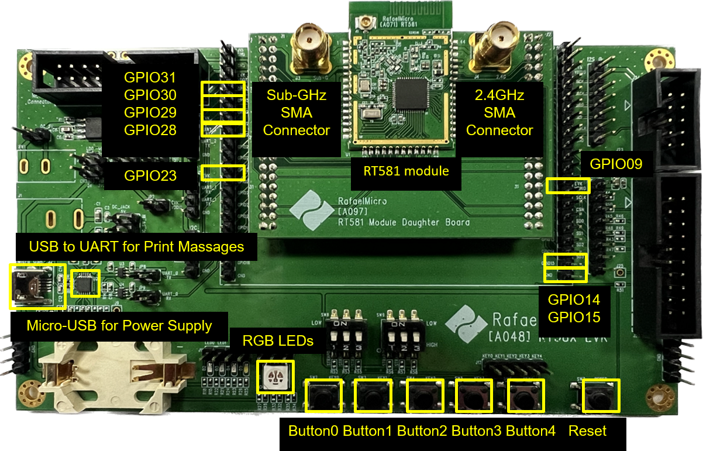

# Mesh It Up (MIU) Quick Start

This document guides you through the essential steps to quickly set up your development environment, compile and flash a basic MIU example, and verify its successful operation.

---

## 1. Prerequisites

Before you begin, ensure you have the following hardware:

* MIU Development Board: At least one Rafael RT58x series development board (e.g., an RT58X development board) for initial setup verification.

* USB Cable: To connect your development board to your PC.

* J-Link or CMSIS-DAP Debugger: Required for program flashing and debugging, especially when using the VS Code Extension.
 
### Figure 1: RT58X Development EVK Board
  <p align="center">
    
  </p>


## 2. Development Environment Setup
All necessary steps for setting up your development environment, including software installation, SDK acquisition, and environment variable configuration, are detailed in our dedicated setup guide.

Please refer to the [`Rafael-IoT-SDK Setup Guide`](../../SDK_Setup/) for comprehensive instructions.

This guide covers:

* Installing required software (e.g., Toolchain, Python, Git).

* Obtaining the Rafael-IoT-SDK SDK source code.

* Configuring necessary environment variables.


## 3. First Build and Flash (miu-ftd)
Once your development environment is set up as per the [`Rafael-IoT-SDK Setup Guide`](../../SDK_Setup/), you can proceed to build and flash your first MIU FTD example. Our goal is to simply run the miu-ftd example on a single board to confirm the setup is working.

### 3.1 Select and Build miu-ftd Example:

* Using the Rafael VS Code Extension (typically found in the sidebar or status bar), select the miu-ftd example and your target RT58x board.

* Click the extension's "Build" button.

* Verify that the compilation completes successfully in the VS Code TERMINAL panel. The compiled .bin file (e.g., miu-ftd.bin) will be located in the example's build folder.

### 3.2 Flash miu-ftd Example to Board:

* Ensure your J-Link or CMSIS-DAP debugger is correctly connected to your development board.

* In the Rafael MIU VS Code Extension, click the "Download" button for the miu-ftd example.

* Monitor the flashing process in the VS Code TERMINAL panel.

### 3.3 Connect UART Debug Tool:

* Connect your development board's debug UART interface to your PC using the USB to UART cable.

* Open a terminal program like Tera Term or PuTTY. Configure the correct COM Port and baud rate (e.g., 115200 bps).

### 3.4 Observe Boot Messages:

* After the board reboots (or manually reset it), you should see MIU boot messages and Thread network status output in your UART terminal.

Example Output:

```
Mesh It Up FTD
Band               : SubG_915M
Data Rate          : 300K
Active Timestamp   : 1
Channel            : 1
Wake-up Channel    : 0
Ext PAN ID         : 000db80000000000
Mesh Local Prefix  : fd00:0db8:0000:0000::/64
Network Key        : 00112233445566778899aabbccddeeff
Network Name       : Rafael Miu
Link Mode          : 1, 1, 1
PAN ID             : 0xabcd
Extaddr            : 5600000000000000
UDP PORT           : 0x162e
```

### 3.5 Verification: If you observe similar output, congratulations! Your development environment is correctly set up, and your first MIU example is running successfully.


## 4. Next Steps
Now that you have successfully verified your development environment, you can explore the full capabilities of the MIU SDK:

* **Explore other examples:** Learn to run miu-mtd or miu-sniffer to understand different MIU example.
    * [`MIU FTD Example Guide`](example/miu-ftd-guide.md)
    * [`MIU MTD Example Guide`](example/miu-mtd-guide.md)
    * [`MIU Sniffer Example Guide`](example/miu-sniffer-guide.md)
* **Learn about MIU Services:** Dive into Rafael's proprietary Network Management and OTA features.
    * [`Network Management Guide`](Network-management-guid.md)
    * [`OTA Guide`](OTA-guid.md)
* **Utilize MIU Tools:** Discover how to use additional tools, such as the Topology Tool.
    * [`Topology Tool Guide`](Topology-guid.md)