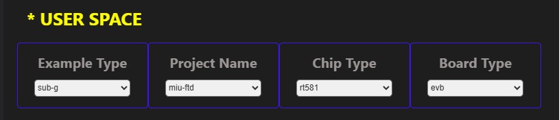

# Mesh It Up (MIU) Quick Start

This document guides you through the essential steps to quickly set up your development environment, compile and flash a basic MIU example, and verify its successful operation.

---

## 1. Prerequisites

Before you begin, ensure you have the following hardware:

* MIU Development Board: At least one Rafael RT58x series development board (e.g., an RT58X development board) for initial setup verification.

* USB Cable: To connect your development board to your PC.

* J-Link or CMSIS-DAP Debugger: Required for program flashing and debugging, especially when using the VS Code Extension.
 
### Figure 1: RT58X Development EVK Board
  <p align="center">
    
  </p>


## 2. Development Environment Setup
All necessary steps for setting up your development environment, including software installation, SDK acquisition, and environment variable configuration, are detailed in our dedicated setup guide.

Please refer to the [`Rafael-IoT-SDK Setup Guide`](../../SDK_Setup/) for comprehensive instructions.

This guide covers:

* Installing required software (e.g., Toolchain, Python, Git).

* Obtaining the Rafael-IoT-SDK SDK source code.

* Configuring necessary environment variables.


## 3. First Build and Flash (miu-ftd)
Once your development environment is set up as per the [`Rafael-IoT-SDK Setup Guide`](../../SDK_Setup/), you can proceed to build and flash your first MIU FTD example. Our goal is to simply run the miu-ftd example on a single board to confirm the setup is working.

### 3.1 Select and Build miu-ftd Example:
### Figure 2: RT58X miu build ftd user space
  <p align="center">
    
  </p>

* Using the Rafael VS Code Extension (typically found in the sidebar or status bar), select the miu-ftd example and your target RT58x board.

* Click the extension's "Build" button.

* Verify that the compilation completes successfully in the VS Code TERMINAL panel. The compiled .bin file (e.g., miu-ftd.bin) will be located in the example's build folder.

### 3.2 Flash miu-ftd Example to Board:

* Ensure your J-Link or CMSIS-DAP debugger is correctly connected to your development board.

* In the Rafael MIU VS Code Extension, click the "Download" button for the miu-ftd example.

* Monitor the flashing process in the VS Code TERMINAL panel.

### 3.3 Connect UART Debug Tool:

* Connect your development board's debug UART interface to your PC using the USB to UART cable.

* Open a terminal program like Tera Term or PuTTY. Configure the correct COM Port and baud rate (e.g., 115200 bps).

### 3.4 Observe Boot Messages:

* After the board reboots (or manually reset it), you should see MIU boot messages and Thread network status output in your UART terminal.

Example Output:

```
Mesh It Up FTD
Band               : SubG_915M
Data Rate          : 300K
Active Timestamp   : 1
Channel            : 1
Wake-up Channel    : 0
Ext PAN ID         : 000db80000000000
Mesh Local Prefix  : fd00:0db8:0000:0000::/64
Network Key        : 00112233445566778899aabbccddeeff
Network Name       : Rafael Miu
Link Mode          : 1, 1, 1
PAN ID             : 0xabcd
Extaddr            : 5600000000000000
UDP PORT           : 0x162e
```

### 3.5 Verification: If you observe similar output, congratulations! Your development environment is correctly set up, and your first MIU example is running successfully.


## 4. Standard Operating Procedure (SOP) for Network Setup ( Enable (`CONFIG_APP_TASK_CENTRAL_ENABLE=1`, `CONFIG_APP_TASK_CENTRAL_ENABLE=1`) for network management)

This section guides you through the process of establishing a **Leader-Router-MTD** network from scratch using three EVK boards, and verifying the entire system's functionality.

### 4.1 Device Preparation and Flashing

Prepare 3 EVK development boards (assumed as EVK #1, #2, #3).

| Device | Firmware to Flash | Network Role | Notes |
| :--- | :--- | :--- | :--- |
| **EVK #1** | `miu-ftd.bin` | Leader | **Critical:** Ensure **GPIO 22 is physically grounded** (Low level). |
| **EVK #2** | `miu-ftd.bin` | Router | Wait for provisionig windows start to join the network. |
| **EVK #3** | `miu-mtd.bin` | MTD (Child) | Wait for provisionig windows start to join the network. |

> ❗ **Leader Device Requirement (EVK #1):** The MIU SDK enforces that the device assuming the Thread Leader role must have its **GPIO 22 grounded** (Low Level).

### 4.2 Network Formation and Initialization

1.  **Factory Reset:** To ensure a clean start, it is recommended to factory reset all devices (or perform a clean flash).
    ```bash
    ot factoryreset
    ```
### 4.3 Ledader open provisioning windows
1.  **Power On Leader (EVK #1):**
    * After power-on, the Leader will automatically scan and form a new Thread network.
2.  **Verify Leader State:**
    * In the CLI terminal for EVK #1, input:
        ```bash
        ot state
        ```
    * **Expected Output:** `leader`
3.  **Open the provisioning windows and allow the road network:**
    * In the CLI terminal for EVK #1, input:
        ```bash
        app provisioner start 120
        ```
### 4.4 Router and MTD Automatic Join

1.  **Power On Router (EVK #2) and MTD (EVK #3).**
2.  The Router and MTD will automatically scan and join the network established by EVK #1.
3.  **Verify States:**
    * In the CLI terminal for EVK #2, input `ot state`. **Expected Output:** `router`
    * In the CLI terminal for EVK #3, input `ot state`. **Expected Output:** `child`

---

## 5. Network Functionality Verification

### 5.1 LED Status Verification

Observe the LED indicators on each device to confirm the network state.
LED 0 : (gpio20, gpio 15)
LED 1 : (gpio21, gpio 14)

| Network State |Leader LED Behavior |
| :--- | :--- |
| **Out-of-Network** | All LED Off |
| **Change to Leader** | Slow Blinking 2 LED (e.g., 1s on/off)|

| Network State |  Other Device LED Behavior |
| :--- | :--- |
| **Out-of-Network** | Slow LED 0 Blinking  (e.g., 1s on/off) |
| **Network enrolling** | Fast LED 0 Blinking (e.g., 100ms on/off) |
| **Enrolling success** | Slow LED 1 Blinking (e.g., 1s on/off) |

> 💡 **LED GPIO Pinout Reference:** For the specific GPIO pin used for the LED on each device and the underlying code logic, please refer to the current layout board.

### 5.2 Application Layer Communication Test

We will use the Leader to send a remote control command to the MTD, verifying end-to-end application layer connectivity.

1.  **Get MTD's Mesh Local EID:**
    * In the MTD (EVK #3) CLI terminal, input:
        ```bash
        ot ipaddr mleid
        ```
    * **Example Output:** `fd00:db8:0:0:a0b4:c3d2:5e67:890a` (This is the MTD's unique IP address in the Mesh network).

2.  **Send Control Command from Leader:**
    * Return to the Leader (EVK #1) CLI terminal and input the `app ctrl` command.
    * **Command Format:** `app ctrl <Target EID/RLOC IPv6> <Command Code>`
    * **Example:** Assuming the Command Code `0x03` is defined as **TOGGLE LED**.
        ```bash
        app ctrl fd00:db8:0:0:a0b4:c3d2:5e67:890a 0x03
        ```
    * **Expected Result:** The LED on the MTD (EVK #3) should **change its state** (e.g., ON to OFF or vice versa).

2.  **Send ping Command from Leader:**
    * Return to the Leader (EVK #1) CLI terminal and input the `ot ping` command.
    * **Command Format:** `ot ping <Target EID/RLOC IPv6> <Size> <Count>`
    * **Example:**
        ```bash
        ot ping fd00:db8:0:0:a0b4:c3d2:5e67:890a 64 1
        ```
    * **Expected Result:**
        ```bash
        72 bytes from fd00:db8:0:0:a0b4:c3d2:5e67:890a: icmp_seq=1 hlim=64 time=39ms
        1 packets transmitted, 1 packets received. Packet loss = 0.0%. Round-trip min/avg/max = 39/39.0/39 ms.
        ```
        
### 5.3 Topology Visualization Verification

1.  **Launch Topology Tool:** Run the Topology Tool software and establish a connection to the Leader (EVK #1).
2.  **Confirm Topology Structure:** The software interface should display a three-node network topology:
    * **Leader** (EVK #1)
    * **Router** (EVK #2)
    * **Child/MTD** (EVK #3)

> 🔗 **Detailed Instructions:** For utilising the Topology Tool, please refer to the dedicated [`Topology-Tool-guide.md`](Topology-Tool-guide.md).

---

## 6. Further Steps

You have successfully built and verified the MIU Mesh network. Please refer to the following guides for code details and advanced features:

* **Code and Feature Deep Dive:**
    * [`miu-ftd Example Guide`](example/miu-ftd-guide.md)
    * [`miu-mtd Example Guide`](example/miu-mtd-guide.md)
* **Diagnostics and Debugging:**
    * [`miu-sniffer Example Guide`](example/miu-sniffer-guide.md)
* **Advanced Features (To be completed):**
    * [`OTA Guide`](OTA-guide.md)
    * [`Topology Tool Guide`](Topology-Tool-Guide.md)