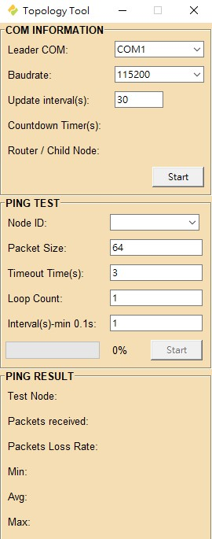
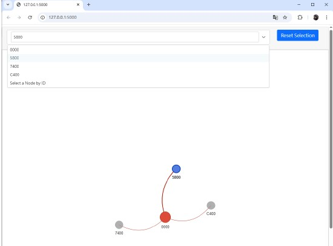
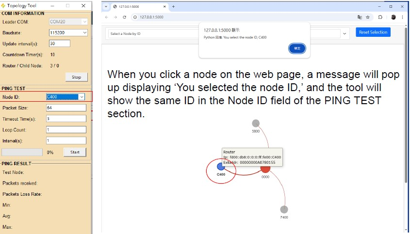

# Topology-Tool-guid.md

## Thread Topology Tool User Guide

## 1. Introduction

The **Thread Topology Tool** is a proprietary utility presented by Rafael Microelectronics. It is used to visualize, manage, and test the status and connectivity of a deployed Mesh It Up (MIU) Thread network.

---

## 2. Tool Graphical User Interface (GUI) Overview

The GUI of the Topology Tool is divided into three main sections:

### Figure 1: Topology Tool Gui
  

    
  

  
1.  **COM INFORMATION**: Configuration for the serial connection to the Leader device.
2.  **PING TEST**: Parameters for performing connectivity tests to any node in the network.
3.  **PING RESULT**: Display area for the results and statistics of the PING tests.

---

## 3. Detailed Component Functions

### 3.1 COM INFORMATION

This section configures the communication link to the **Leader** device, which acts as the data source for the entire network topology.

| Field | Description | Default Value |
| :--- | :--- | :--- |
| **Leader COM** | Select the serial (COM) port connected to the Thread Leader device. Choosing the correct port will display the topology web page. | COM1 |
| **Baudrate** | Sets the communication speed for the selected COM port. | 115200  |
| **Update interval(s)** | The frequency (in seconds) the tool uses to query the leader and update router and child information. The web page will refresh when the number of router or child nodes changes. | 30  |
| **Countdown Timer(s)** | Displays the time remaining until the next automatic update. | - |
| **Router/Child Node** | Displays the number of routers and child nodes. | - |
| **Start / Stop** | Click 'Start' to retrieve the leader information. The button changes to 'Stop' when connected. | - |

### 3.2 PING TEST

This section allows the user to perform PING tests from the **Leader** device to any other specified node in the network.

| Field | Description | Default Value |
| :--- | :--- | :--- |
| **Node ID** | The IPv6 address or Node ID of the target device to PING. The drop-down list displays all nodes queried from the leader. Users can select a single node or 'all' nodes for the test. | - |
| **Packet Size** | The size of the ICMP PING packet payload in bytes. | 64 |
| **Timeout Time(s)** | The maximum time (in seconds) the tool will wait for a PING response. | 3  |
| **Loop Count** | Defines how many times the PING test will be executed. | 1  |
| **Interval(s)** | Specifies the time interval (in seconds) between sending each PING command. | 1  |
| **Start** | Click the 'Start' button to initiate the PING test. | - |

### 3.3 PING RESULT

This section displays the detailed output and statistics from the executed PING tests.

| Field | Description | Example Result |
| :--- | :--- | :--- |
| **Test Node** | The target Node ID that was tested. | C400 |
| **Packets received** | The total number of PING replies received. | 1 |
| **Packets Loss Rate** | The percentage of PING packets that did not receive a reply. | 0.0%  |
| **Min** | The minimum Round Trip Time (RTT) observed. | 34 ms  |
| **Avg** | The average Round Trip Time (RTT) observed. | 34.0 ms  |
| **Max** | The maximum Round Trip Time (RTT) observed. | 34 ms  |

---

## 4. Topology Visualization and Logging

### Topology Visualization

When the tool successfully queries the leader node, the web page will open (e.g., `127.0.0.1:5000`) and display the relationships between the nodes.

### Figure 2: Topology Tool Web
  

    
  

  
* When you click a node on the web page, a message will pop up displaying "You selected the node ID," and the tool will show the same ID in the **Node ID** field of the PING TEST section.
* When a node is selected, the web page will display its connection.
* Click **'Reset Selection'** to display the entire topology.

### Data Log Output

The tool saves several types of logs for tracking network status and PING activity:

| Log Type | Folder Name | File Name Example | Saved Content |
| :--- | :--- | :--- | :--- |
| **Nodes Log** | `Logs_Nodes` | `TBD-TC-TOPO-time.txt` | Records the Leader IP, Router node list, Child node list, and Relation list. |
| **PING Log** | `Logs_Ping`  | `PingResult-time.txt` / `.xlsx` | `.txt` saves the progress of the ping test; `.xlsx` saves the final result of every ping test. |
| **Web Page Log** | `Logs_Webpage` | `TBD-TC-TOPO-time.html` | Stores the HTML structure of the topology visualization. |

---

## 5. Operation Steps

1.  **Connect Leader:** Connect the serial interface of the Thread Leader device to your PC.
2.  **Configure COM:** In the **COM INFORMATION** section, select the correct **Leader COM** port and **Baudrate**.
3.  **Set Update Interval:** Set the desired **Update interval(s)**.
4.  **Start Data Collection:** Click the **'Start'** button to retrieve the leader information.
5.  **Observe Topology:** The network topology will be displayed visually.
6.  **Run PING Test (Optional):**
    * Select the **Node ID** in the **PING TEST** section.
    * Set the desired **Packet Size**, **Timeout Time(s)**, **Loop Count**, and **Interval(s)**.
    * Click the **'Start'** button in the **PING TEST**.
### Figure 3: Topology Tool Ping
  

    
  

7.  **Review Results:** Check the summarized statistics (Test Node, Packets received, Loss Rate, Min, Avg, Max) in the **PING RESULT** section.