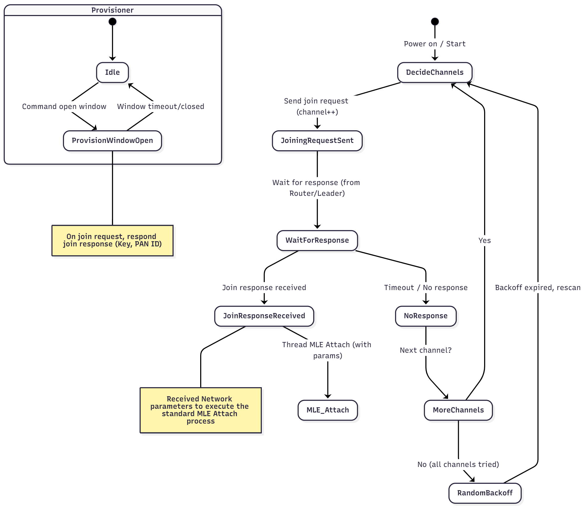

# miu-mtd Example Guide

## 1. What is the miu-mtd Example?

The `miu-mtd` example demonstrates a Minimal Thread Device (MTD) implementation in the Mesh It Up (MIU) SDK.
It is designed for low-power end devices that join an existing Thread network via the provisioning (commissioning) process.
Compared with the Full Thread Device (FTD), it focuses on energy efficiency and simplified network participation, while maintaining compatibility with MIU Network Management and application-level command handling.

---

## 2. Configuration Options

The `miu-mtd` example behavior is controlled by several build-time options:

* **`CONFIG_APP_TASK_CENTRAL_ENABLE`**:
    When enabled (`=1`), the device can be managed through MIU Network Management.
    Only when it is turned on will the registration information be sent to the leader.

* **`CONFIG_APP_TASK_CONTROL_CMD_ENABLE`**:
    Enables application-level control commands (e.g., LED control, custom command packets).
    When disabled, the device only supports basic Thread join and UDP data exchange.

* **`CONFIG_HOSAL_SOC_IDLE_SLEEP = y`**:
    Enables MCU idle-sleep capability. The MTD will automatically enter low-power sleep mode when no active task is running.

* **`CONFIG_HOSAL_SOC_SLEEP_TIMER_ID = 4`**:
    Defines the hardware timer used to maintain timing accuracy during sleep and wake-up cycles.

---

## 3. Application Structure and Core Functions (app_task.c Deep Dive)

The `app_task.c` file implements the core application logic, utilizing FreeRTOS for task management and integrating the various MIU proprietary features on top of OpenThread.

### 3.1 Application Tasks and Event Handling
The main application logic runs within a FreeRTOS task (`app_task`). It uses a **Queue** (`appEventQueue`) and a **Semaphore** (`appSemHandle`) for thread-safe communication and event processing.

* **`ot_stateChangeCallback`**: This is a critical function registered with the OpenThread stack. When the device's Thread state changes (e.g., to Leader, Router, or Child), this callback is triggered.
    * It logs the device's new role and its key IPv6 addresses (RLOC, Mesh Local EID).
    * It sends an application event (`APP_EVENT_CHANGE_ROLE`) to the main application queue to update application-specific behavior, such as LED indication.

### 3.2 Application Layer Services
The `app_task.c` integrates and utilizes the following MIU services (enabled via configuration flags):
* **Network Management (app_net_mgm.h)**: Centralized network orchestration.
* **Application Control Commands (app_control_cmd.h / app_udp.h)**: Handles incoming UDP packets and parses them into executable control commands (e.g., LED Toggle).
* **Over-the-Air (OTA) (app_ota.h)**: Manages firmware updates.
* **LED Control (app_led.h)**: Manages application-specific LED behaviors.

---

## 4. LED Indicator and GPIO Pinout

The application uses an application-specific LED to visually indicate the device's network state, which is handled by the `app_led.h` module and triggered by the role change in `ot_stateChangeCallback`.

| Network State |  Other Device LED Behavior |
| :--- | :--- |
| **Out-of-Network** | Slow LED 0 Blinking  (e.g., 1s on/off) |
| **Network enrolling** | Fast LED 0 Blinking (e.g., 100ms on/off) |
| **Enrolling success** | Slow LED 1 Blinking (e.g., 1s on/off) |

---

## 5 Common Standard OpenThread Commands
All standard OpenThread commands must be prefixed with `ot`.

| Command | Purpose | Example |
| :--- | :--- | :--- |
| `ot state` | Returns the device's current Thread role (e.g., leader, router). | `ot state` |
| `ot dataset` | Manages the Active or Pending Operational Dataset (network parameters). | `ot dataset panid 0x1234` |
| `ot ipaddr` | Displays various IPv6 addresses (Mesh Local, Link Local, etc.). | `ot ipaddr mleid` |
| `ot ping` | Sends an ICMPv6 Echo Request (ping) to another node. | `ot ping fd00::xxxx` |
| `ot factoryreset` | Erases all Thread network credentials stored in flash memory. | `ot factoryreset` |

---

## 6. Sub-GHz Frequency & Data Rate Configuration

The MIU SDK leverages the Rafael RT58x's Sub-GHz capabilities, allowing flexible configuration of frequency bands and data rates. These are defined at **compile-time** using specific configuration macros, typically found in `sdk_config.h` or the project's `CMakeLists.txt`.

* **Frequency Band (e.g., `CONFIG_SUBG_FREQUENCY_BAND_915`)**:
    These macros determine the operating Sub-GHz frequency band for the device. Options include:
    * `CONFIG_SUBG_FREQUENCY_BAND_915` (915 MHz)
    * `CONFIG_SUBG_FREQUENCY_BAND_868` (868 MHz)
    * `CONFIG_SUBG_FREQUENCY_BAND_470` (470 MHz)
    * `CONFIG_SUBG_FREQUENCY_BAND_433` (433 MHz)
      
    By default, `HOSAL_RF_BAND_SUBG_915M` is often selected.

* **Data Rate (e.g., `CONFIG_SUBG_DATA_RATE_FSK_300K`)**:
    These macros select the physical layer data rate for Sub-GHz communication. Options include:
    * `CONFIG_SUBG_DATA_RATE_FSK_300K` (300 kbps FSK)
    * `CONFIG_SUBG_DATA_RATE_FSK_200K` (200 kbps FSK)
    * `CONFIG_SUBG_DATA_RATE_FSK_100K` (100 kbps FSK)
    * `CONFIG_SUBG_DATA_RATE_FSK_50K` (50 kbps FSK)
    * `CONFIG_SUBG_DATA_RATE_OQPSK_25K` (25 kbps OQPSK)
      
    The default is often `HOSAL_RF_PHY_DATA_RATE_300K`.

**Important:** For devices to communicate within the same mesh network, they **must be configured with the same frequency band and data rate** during compilation.

-----

## 7. Network Join Flow

Unlike the FTD, which can form a network with default parameters when flash is empty,
the MTD must actively perform a join process to obtain the Thread credentials (Network Key, PAN ID, Channel, etc.) from a Provisioner (Leader/Router).

Provisioning Sequence Overview

The MTD acts as a Joiner, while the FTD or Leader acts as a Provisioner.

| Step	| Joiner (MTD) Action	| Provisioner (Leader/Router) Action |
| :--- | :--- | :--- |
| 1	| Power on and scan available channels	| Waits for join requests |
| 2	| Send JOIN REQUEST	| Responds with JOIN RESPONSE (Key, PAN ID) if provisioning window is open |
| 3	| Receive JOIN RESPONSE	| Stores received parameters and starts standard MLE Attach |
| 4	| Join successful	| Closes provisioning window or times out | 


##  8. Process Diagram

### Figure 1: Flow Overview
  <p align="center">
    
  </p>

The Joiner repeatedly scans channels and sends join requests until it receives a valid Join Response from the Provisioner.
If all channels are tried without success, it waits for a random backoff period before retrying.

---
##  9. Power Saving Behavior

The MTD example prioritizes low power operation.
When idle, the system enters deep sleep through hosal_soc_sleep() while maintaining accurate time using CONFIG_HOSAL_SOC_SLEEP_TIMER_ID.

After wake-up:

* System time is compensated automatically.

* Pending events such as join retries or network messages resume seamlessly.


##  10. Getting Started: Joining a Network (Two Devices)

### 10.1 Device 1: Leader/Provisioner (using miu-ftd)

1. Flash miu-ftd.bin and start it as the Leader (ot state leader).

2. Open the provisioning window by command(app provisioner <start/stop> <time (s)> ) or automatically when the network starts.

### 10.2 Device 2 — Joiner (using miu-mtd)

1. Flash miu-mtd.bin.

2. Power on — device starts scanning channels.

3. It will send JOIN REQUEST frames.

4. When the Provisioner window is open, it receives JOIN RESPONSE (Key, PAN ID).

5. Once network parameters are received, it attaches to the Thread network.

CLI output example:

```
Mesh It Up MTD
Band             : SubG_915M
Data Rate        : 300K
Active Timestamp : 1
Channel          : 1
Ext PAN ID       : 000db80000000000
Mesh Local Prefix: fd00:0db8:0000:0000::/64
Network Key      : 00112233445566778899aabbccddeeff
Network Name     : Rafael Miu
Link Mode        : 1, 0, 0
PAN ID           : 0xabcd
Extaddr          : 5600000000000000
UDP PORT         : 0x162e
```

At this point, you have successfully formed a two-device Thread Mesh network!

-----

## 11. UDP Communication and Application

The `miu-mtd` example includes basic UDP communication capabilities, allowing devices to send and receive data, including application-specific control commands. The MIU SDK provides specialized CLI commands to interact with these application-level features.

### 11.1 Sending Raw UDP Data (`app udp send`)

You can send arbitrary hexadecimal or string data as a UDP payload to a specific IPv6 address. This is useful for testing raw data transfer.

* **Syntax:**
    ```bash
    app udp send <ipv6> -x <hex data>
    app udp send <ipv6> -c <string data>
    ```
* **Example: Sending raw hexadecimal data:**
    Send `123456` as hexadecimal data to Device 2's Mesh IPv6 Address:
    ```bash
    app udp send fd00:db8:0:0:200:0:0:0 -x 123456
    ```

### 11.2 Other Application Commands (`app help`)

To see other basic application-level CLI commands, type `app help`:

```bash
app help
```

Output:

```
app udp send <ipv6> -x <hex data>
app udp send <ipv6> -c <string data>
app udp port
app led <on/off/toggle/flash>
app ctrl <ipv6> <cmd id> [data]
```

-----

## 12. Setting Network Parameters via CLI

Beyond the default configuration, you can dynamically adjust various Thread network parameters using the OpenThread CLI.

```bash
ot dataset panid 0x1234
ot dataset commit active
```

These settings will be stored in flash memory and automatically loaded after a reboot. You can verify the changes using `ot dataset active`.

> 📚 **For more advanced dataset usage:**
> Refer to the full OpenThread [dataset CLI documentation](../../../../components/network/mesh-it-up/miu_openthread/src/cli/README_DATASET.md) for additional commands like `networkkey`, `channel`, `extpanid`, `masterkey`, etc.

> ❗ **Reminder:**
> When using OpenThread [commands](../../../../components/network/mesh-it-up/miu_openthread/src/cli#readme), remember to prefix them with `ot`.
> For example: `ot state`, `ot dataset`, `ot factoryreset`.

-----

## 13. Next Steps

Now that you've successfully created a basic Mesh network with `miu-mtd` devices, you can explore more advanced functionalities:

* **Explore other examples:** Learn to run `miu-ftd` or `miu-sniffer` to understand different MIU example.
    * [`miu-ftd Example Guide`](miu-ftd-guide.md)
    * [`miu-sniffer Example Guide`](miu-sniffer-guide.md)
* **Learn about MIU Services:** Dive into Rafael's proprietary Network Management and OTA features.
    * [`Network Management Guide`](../Network-management-guide.md)
    * [`OTA Guide`](../OTA-guide.md)
* **Utilize MIU Tools:** Discover how to use additional tools, such as the Topology Tool.
    * [`Topology Tool Guide`](../Topology-Tool-guide.md)