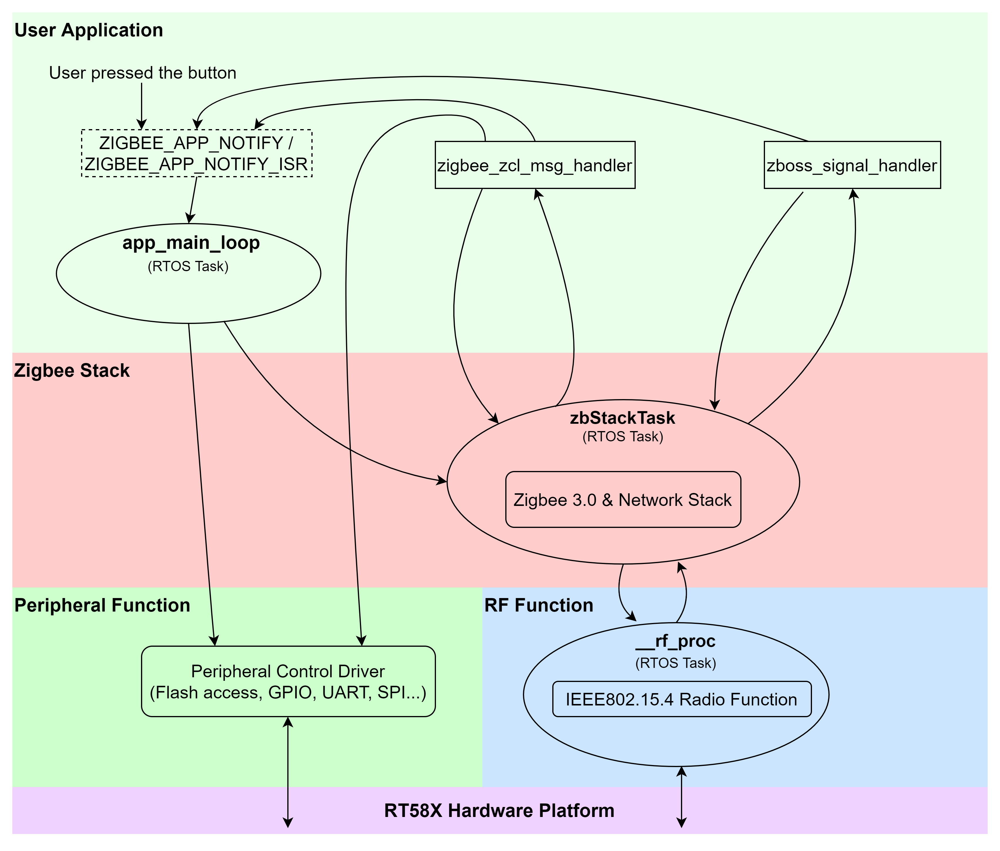

# Zigbee Application Note
## Introduction
This article primarily introduces the information required for developing Zigbee applications using the RT58x platform, including:

* Rafael Zigbee Application Software Flow
* Explanation of the Zigbee Example Source Code File Structure
* Operations of the RT58x Evaluation Board
* Compilation method for the Zigbee Example
* Zigbee application demo
## Rafael Zigbee Application Software Flow

This workflow diagram illustrates the software interaction within a Zigbee-based application, structured in a layered architecture from application level down to hardware platform. The flow demonstrates how user interaction is processed and managed through various software layers and finally transmitted via hardware.

When the user presses a button, an event notification (ZIGBEE_APP_NOTIFY or ZIGBEE_APP_NOTIFY_ISR) is triggered and sent to the application's main loop (app_main_loop), which operates as a task within a Real-Time Operating System (RTOS). This notification triggers the app_main_loop, which operates as an RTOS task that serves as the primary entry point and handler for user-level application logic.

The app_main_loop is responsible for distributing messages or events to various handlers, such as the Zigbee Cluster Library (ZCL) message handler (zigbee_zcl_msg_handler) or the Zigbee Stack signal handler (zboss_signal_handler). These handlers interact with the Zigbee Stack task (zbStackTask), which also runs as an RTOS task.

The Zigbee Stack includes the Zigbee 3.0 and network stack, which processes messages from the upper-layer application and handles protocol-specific tasks. The Zigbee 3.0 & Network Stack implements Zigbee protocol functionality, managing network communication, packet routing, and data handling based on the Zigbee 3.0 specification. The zbStackTask interacts with the underlying RF processing task (__rf_proc), which handles IEEE802.15.4 wireless communication. The zbStackTask communicates bidirectionally with both upper-layer handlers (zigbee_zcl_msg_handler and zboss_signal_handler) and lower-layer peripheral and RF functionality.

Additionally, app_main_loop and zbStackTask access hardware resources through the Peripheral Control Driver, managing GPIO, UART, SPI, Flash, and other hardware functions.

The lowest layer, labeled as RT58X Hardware Platform, represents the physical hardware components and integrated circuits that perform the actual signal transmission, peripheral operations, and RF communications as instructed by the software tasks described above.

Rafael Zigbee Application Software Flow design enables Zigbee applications to efficiently translate user actions into concrete device behavior and communicate with other devices within the wireless network, fulfilling the goals of smart connected device applications.

## Zigbee Example Source Code File Structure
```
examples/zigbee/lighting-app/
├── include
│   ├── device_api.h
│   ├── zigbee_api.h
│   └── zigbee_zcl_msg_handler.h
└──  src
    ├── device_api.c
    ├── main.c
    ├── zcl_construction.c
    ├── zigbee_api.c
    └── zigbee_zcl_msg_handler.c
```
A Zigbee example consists of the files listed above. The content of each file varies depending on the Zigbee device type. Here, the explanation is based on the files related to ```./examples/zigbee/lighting-app/```.

* main.c
This file serves as the entry point (main) of the Zigbee application. It initializes the Zigbee stack, RF hardware, and checks device reboot conditions. The main application loop (app_main_loop) handles Zigbee events like network initialization, network joining processes, and managing device states upon different Zigbee stack events.

* device_api.c
This file implements device-specific control functions, primarily for managing PWM (Pulse Width Modulation) operations. It initializes PWM settings (pwm_ctl_init) with specified frequency and output pins, and provides a function (pwm_ctl_set_level) to adjust PWM duty cycles to control device brightness levels​.

* zcl_construction.c
This source file contains attribute definitions and Zigbee Cluster Library (ZCL) configurations, including basic device attributes, OTA (Over-The-Air) update attributes, and definitions for Zigbee endpoints and clusters. It describes the supported functionality, including basic device information, firmware details, and OTA upgrade parameters.

* zigbee_api.c
Defines the Zigbee-specific API functions responsible for managing network startup (zigbee_app_nwk_start), OTA update checks, handling scene databases, startup configurations, and responding to Zigbee stack signals. The file contains event-handling mechanisms essential for Zigbee operations and interactions with hardware component.

* zigbee_zcl_msg_handler.c
This file handles ZCL messages received from other Zigbee devices, processing commands for managing device states, scenes, groups, and on/off operations. It includes detailed implementations of timers to manage device state transitions, dimming effects, and various ZCL command processes like adding, removing, storing, or recalling scenes​.

* device_api.h
A header file defining the prototypes for device-specific control functions, primarily for PWM control (pwm_ctl_init, pwm_ctl_set_level). It serves as the interface to the corresponding ```.c``` implementation for device-level hardware control.

* zigbee_api.h
A header file providing declarations of essential data structures (scene_entry_t, startup_entry_t) and function prototypes that interface with Zigbee network management, event handling, scene management, and startup configurations. This header serves as an essential reference for the Zigbee-related application logic and interactions.

* zigbee_zcl_msg_handler.h
Declares the function prototype for handling Zigbee Cluster Library (ZCL) messages (zigbee_zcl_msg_handler). This handler processes incoming ZCL commands from the Zigbee stack and ensures appropriate reactions or actions in the application context.

## Compilation and Image update Procedure
For information regarding the compilation and image update methods of the Zigbee examples, please refer to:
[Firmware Update Procedure](./EnvironmentSetup.md)
