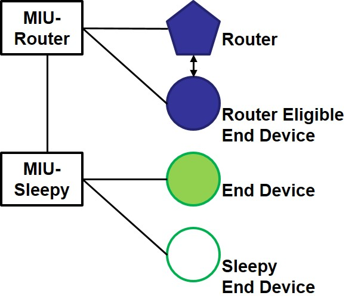

# Mesh It Up (MIU)

**Mesh It Up (MIU)** uses Sub-GHz communication over OpenThread to implement application and network management.

## Device Types

Rafael provides the following types of devices:

- **miu-router**  
  Corresponds to OpenThread FTD (Full Thread Device).  
  It can act as a Leader, Router, or Child.

- **miu-sleepy**  
  Corresponds to OpenThread MTD (Minimal Thread Device).  
  It functions only as a Child.

- **miu-sniffer**  
  Corresponds to OpenThread RCP (Radio Co-Processor).  
  It is used for network packet sniffing.

  

    
  

  *Figure: Example topology using `miu-router` and `miu-sleepy` devices.*

## Roadmap

In the future, we plan to add:

- **miu-ble-router**  
  Supports both Sub-GHz (OpenThread) and Bluetooth Low Energy (BLE) functionalities,  
  while maintaining existing Sub-GHz operations.

- **miu-ble-sleepy**  
  Supports both Sub-GHz (OpenThread) and BLE functionalities,  
  while maintaining existing Sub-GHz operations.

  

    
  

  *Figure: BLE-capable extension with `miu-ble-router` and `miu-ble-sleepy` support.*
