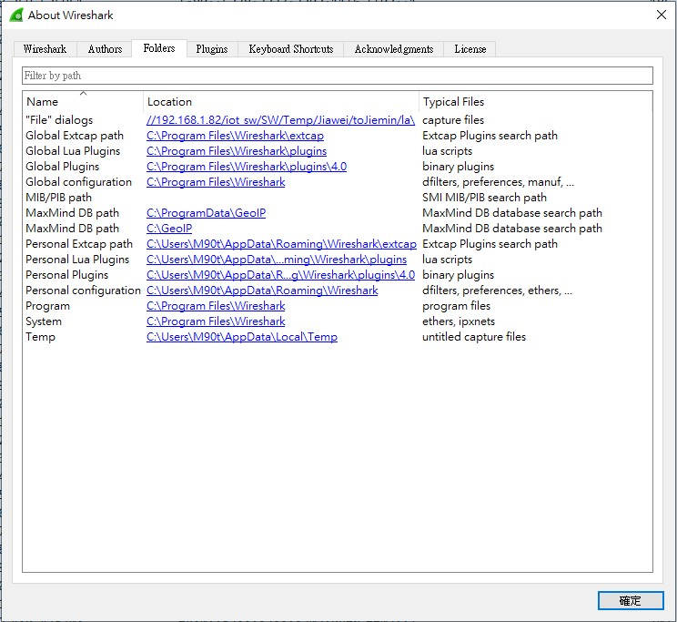
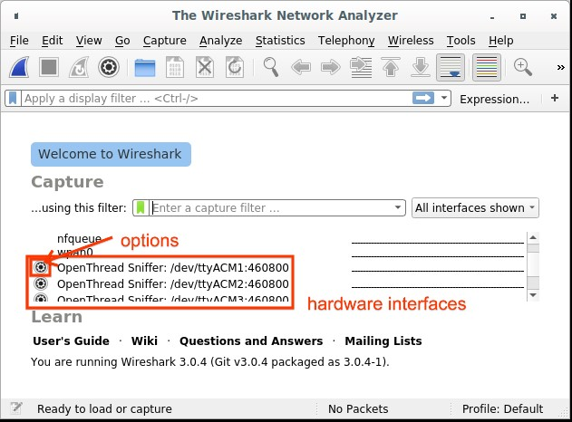
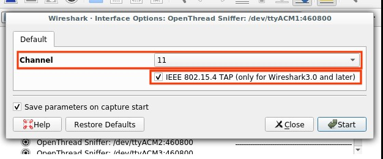
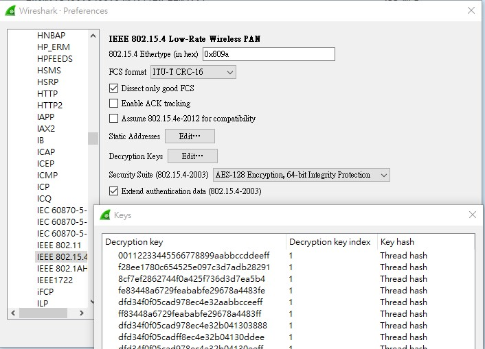
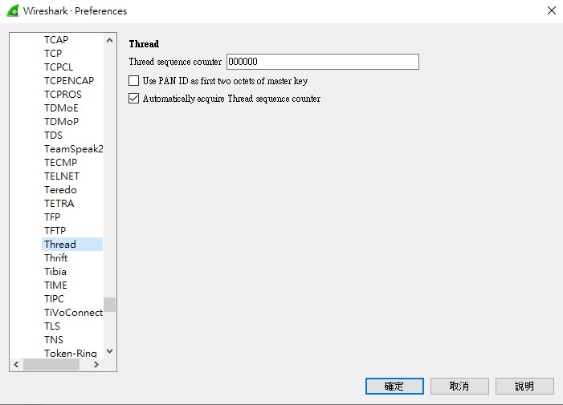
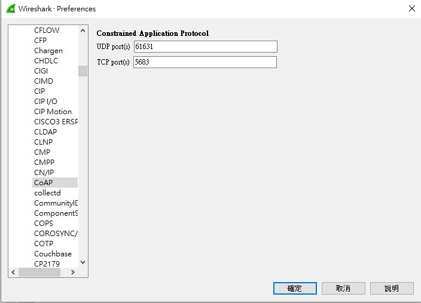

# miu-sniffer Example

## What is the miu-sniffer Example?

The `miu-sniffer` example is based on the OpenThread RCP (Radio Co-Processor). In this example, it is used as a sniffer to capture Thread network packets and display them in Wireshark. The following sections describe how to configure and use this setup.

In the `ncp.c` file, you will find the following configuration:

```c
CONFIG_APP_OT_NCP_OPERATION_UART_PORT
```

By default, this is set to UART0. However, users can change it to `1` to use UART1 for communication with Wireshark.

---

## Required Tools

Please download and install the following tools:

* **Python (version 3.7 or later)**
  [https://www.python.org/downloads/release/python-379/](https://www.python.org/downloads/release/python-379/)

* **Wireshark**
  [https://www.wireshark.org/download.html](https://www.wireshark.org/download.html)

Install `pyspinel` using pip:

```bash
pip3 install pyspinel
```

Then copy `extcap_ot.py` and `extcap_ot.bat` (from [https://github.com/RafaelMicro/pyspinel.git](https://github.com/RafaelMicro/pyspinel.git)) into Wireshark's extcap directory. Refer to the illustration below for the correct path.

  <p align="center">
    
  </p>

After setup, restart Wireshark and check if the "sniffer" interface appears. If not, go to **Capture → Refresh Interfaces** to rescan available interfaces.

  <p align="center">
    
  </p>

---

## Wireshark Options Settings

1. Set the **Channel** to your desired value.
2. Check **IEEE 802.15.4 TAP** to ensure channel information is included in the pcap output and visible in the Wireshark GUI.
3. Check **Save parameters on capture start** to retain these settings for future use (unless a channel change is needed).
4. Click **Start** to begin capturing.
  
  <p align="center">
    
  </p>

---

## Thread Protocol Configuration in Wireshark

Navigate to **Preferences → Protocols** in Wireshark to configure protocol settings.

### IEEE 802.15.4

1. Click the `+` button to add a new decryption key.
2. Enter the **Thread Network Master Key** in the **Decryption Key** field.
3. Set the **Decryption Key Index** to `1`.
4. Set **Key Hash** to `Thread hash`.

  <p align="center">
    
  </p>

### Thread

1. Set the **Thread sequence counter** to `00000000`.
2. Uncheck **Use PAN ID as first two octets of master key**.
3. Check **Automatically acquire Thread sequence counter**.

  <p align="center">
    
  </p>

### CoAP

1. Set the **UDP port** to `61631`.
2. Set the **TCP port** to `5683`.

  <p align="center">
    
  </p>

---

After completing these steps, you will be able to view Thread network packets in Wireshark.

These settings typically only need to be configured once. However, if certain parameters change (such as the IEEE 802.15.4 network key), you will need to update the corresponding settings again.