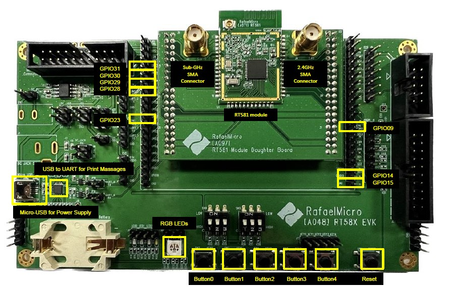

# Instructions for Operating subg Sample

The following image shows the GPIOs used by this sample and their corresponding positions.

The operating instructions for Tx mode are as follows:
- When button 0~4 is pressed for the first time, the corresponding data rate will be selected.
  + For example, if button 0 is pressed for the first time, 6.25 Kbps will be selected for testing.
- If the same button is pressed a second time, the Tx test will begin.
  + For example, if button 0 is pressed a second time, the Tx test will be performed.
- If the same button is pressed a third time, it will behave like the first button press and stop the Tx test.
  + For example, when button 0 is pressed a third time, the Tx test will stop, and the data rate will be set to 6.25 Kbps.

The operating instructions for Rx mode are as follows:
- When button 0~4 is pressed for the first time, the corresponding data rate will be selected.
  + For example, if button 0 is pressed for the first time, 6.25 Kbps will be selected for testing.
- If the same button is pressed a second time, the Rx test will begin.
  + For example, if button 0 is pressed a second time, the Rx test will be performed.
- If the same button is pressed a third time, it will behave like the first button press and stop the Rx test.
  + For example, when button 0 is pressed a third time, the Rx test will stop, and the data rate will be set to 6.25 Kbps.

# Testing Methods

* EVK1 (Tx mode)
    1. GPIO 15 is floating.
    2. Select the desired frequency band and connect the corresponding GPIO to ground.
    3. Select the desired data rate and press the corresponding button.
    4. Wait for the EVK2 Rx mode test to begin.
    5. Confirm that the EVK2 Rx mode test has started, then press the same button to initiate the Tx mode test.
    6. The blue LED will turn on to indicate that the Tx mode test has started.

* EVK2 (Rx mode)
    1. Connect GPIO 15 to ground.
    2. Select the desired frequency band and connect the corresponding GPIO to ground.
    3. Select the desired data rate and press the corresponding button.
    4. Press the same button to start the Rx mode test.
    5. The red LED will turn on to indicate that the Rx mode test has started.

# Testing Results 

There are two ways to confirm the transmission success rate.
1. Read the UART log related information.
2. Determine based on the LED of the device in Tx mode.
   - pack ack rate > 30%, red led turn on.
   - pack ack rate < 30%, green led turn on.

# Subg Sample Frequency Mapping Table

| GPIO  | Frequency (MHz) |
| ----- | --------------- |
|  31   |      903        |
|  30   |      907        |
|  29   |      911        |
|  28   |      915        |
|  23   |      919        |
|  14   |      923        |
|   9   |      927        |

# Subg Sample Data Rate Mapping Table

|       switch       | Data Rate (Kbps) |
| -----------------  | ---------------- |
|  Button0 (GPIO0)   |      6.25        |
|  Button1 (GPIO1)   |        50        |
|  Button2 (GPIO2)   |       100        |
|  Button3 (GPIO3)   |       200        |
|  Button4 (GPIO4)   |       300        |

# Subg Sample Tx/Rx mode select

| GPIO15  | Mode |
| -----   | -----|
|  0      |  Tx  |
|  1      |  Rx  |

# Subg Sample Tx power

| Tx power | 20dBm |
