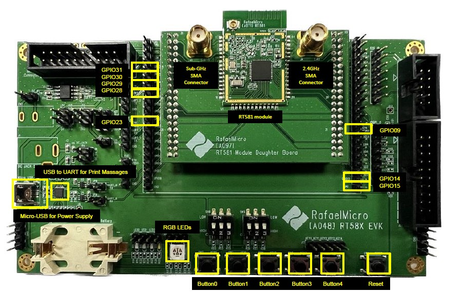
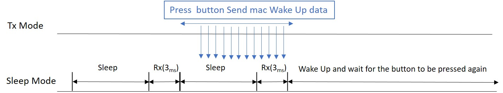

# Instructions for Operating subg Wake on Radio Demo

The following image shows the GPIOs used by this sample and their corresponding positions.

The operating instructions for Tx mode are as follows:
- When buttons 0 to 4 are pressed, the transmission of the wakeup packet will begin according to the data rate.

The operating instructions for Sleep mode are as follows:
- When buttons 0 to 4 are pressed, the wakeup RX time will be set according to the data rate, and the sleep time should be adjusted based on the `SUBG_RX_ON_RADIO_SLEEP_TIME` defined in `main.c`.
  

# Testing Methods

* EVK1 (Tx mode)
    1. Do not use `CONFIG_HOSAL_SOC_IDLE_SLEEP` to compile the code, with an initial value of 300K.
    2. Choose the frequency band, then connect the corresponding GPIO to ground.
    3. Wait for EVK2 to enter sleep mode.
    4. Press the same data rate button to send a wake-up message and wake up the EVK2.
    5. The red LED will turn on to show that the transmit test has started.

* EVK2 (Sleep mode)
    1. Use `CONFIG_HOSAL_SOC_IDLE_SLEEP` to compile the code, with an initial value of 300K.
    2. Choose the frequency band, then connect the corresponding GPIO to ground.
    3. Choose the data rate and press the button to start the wake-on-radio protocol.
    4. If the blue LED is off, the system is running; if it lights up, it means the system has been awakened.

# Wake on Radio Protocol

As shown in the figure, the sleep mode activates the wake-on-radio mechanism after the button is pressed and waits for wake-up data to wake up the device in sleep mode.

# Subg Sample Frequency Mapping Table

| GPIO  | Frequency (MHz) |
| ----- | --------------- |
|  31   |      903        |
|  30   |      907        |
|  29   |      911        |
|  28   |      915        |
|  23   |      919        |
|  14   |      923        |
|   9   |      927        |

# Subg Sample Data Rate Mapping Table

|       switch       | Data Rate (Kbps) |
| -----------------  | ---------------- |
|  Button0 (GPIO0)   |      6.25        |
|  Button1 (GPIO1)   |        50        |
|  Button2 (GPIO2)   |       100        |
|  Button3 (GPIO3)   |       200        |
|  Button4 (GPIO4)   |       300        |

# Subg Sample Tx power

| Tx power | 20dBm |

# Testing Results 

|       switch       | Data Rate (Kbps) | Rx time (ms) | sleep time (ms) | average power consumption (uA) |
| -----------------  | ---------------- | ------------ |---------------- | ------------------------------ |
|  Button0 (GPIO0)   |      6.25        |      35      |      1000       |               468              |
|  Button1 (GPIO1)   |        50        |       8      |      1000       |               113              |      
|  Button2 (GPIO2)   |       100        |       6      |      1000       |               103              |
|  Button3 (GPIO3)   |       200        |       4      |      1000       |                70              |
|  Button4 (GPIO4)   |       300        |       3      |      1000       |                58              |